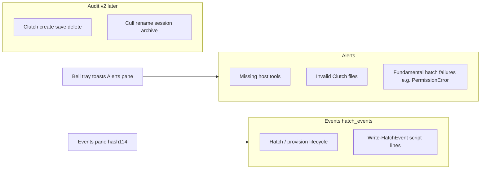

# Alerts-only separation (#158 absorbs #147)

## Product model

| Concern | What belongs | Surface now |
|---|---|---|
| **Alerts** | Conditions that threaten Hatchery working: missing tools, invalid Clutches, rare fundamental failures already using `record_alert` | Bell, tray, toasts, Alerts pane, footer Nest dot |
| **Events** | Under-the-hood hatch/provision transcript (`hatch_events`) | Events pane (#114 — still placeholder; API/data exist) |
| **Audit (v2)** | Who/what changed Clutches; VM removed/renamed; session archived — not “validation”, not per-VM provision log | New issue; **not** kept as noisy activity toasts |

**Default scope decision:** Do this as **one PR under #158** and **close #147 as superseded**. Pane + surfaces + recording cleanup + naming are one concern.

## Naming convention

Use **notifications** only for the **umbrella** (the sidebar group and any docs/file that discusses Alerts + Events + future Audit together).

| Use | Name |
|---|---|
| Umbrella nav / group docs | Notifications |
| Alert-specific module, API, template, seed, tests | **alerts** (`lib/alerts.py`, `/api/alerts`, `alerts.html`, `seed_alerts.py`, `test_alerts.py`) |
| Event-specific (existing / #114) | **events** (`hatch_events`, `/api/.../events`, Events pane) |
| Future audit | **audit** (table/module/API when v2 lands — not this PR) |

Do **not** keep alert-only artifacts named `notifications` after this PR.

## What activity records today (and where they go)

| Current `record_activity` | Disposition |
|---|---|
| VM hatching / provisioning / fledged / script failures | **Drop** — already mirrored (or better) in `hatch_events` via `add_event` |
| Clutch created / saved / deleted | **Drop** from alerts path — track under **v2 audit** issue (no toast) |
| VM removed / renamed / session archived | **Drop** from alerts path — same **v2 audit** issue |

Until #114 ships, users lose global toasts like “VM fledged”; that is intentional — Events is the home for that signal.

## File structure (keep lean; name by concern)

[`lib/notifications.py`](lib/notifications.py) stays small but becomes **alerts-only** and is **renamed**.

**Do in this redesign:**
- Move alerts CRUD to [`lib/alerts.py`](lib/alerts.py) (from `lib/notifications.py`); update imports (`notif_lib` → `alerts_lib` or `from lib import alerts`)
- Delete `record_activity` and all activity UNION/`trim_activity` paths
- Rename template → [`templates/ui/alerts.html`](templates/ui/alerts.html); `alerts_pane` renders it
- Rename API → `GET /api/alerts` (same payload shape, alerts only); update [`static/app.js`](static/app.js) poll URL
- Keep umbrella routes under `/notifications/...` (Alerts/Events children) and sidebar label **Notifications**
- Rename seed script → `.hatchery/tooling/seed_alerts.py` (alerts-only)
- Rename tests → `tests/test_alerts.py` (from `test_notifications.py`); fix app/db tests
- Docs: keep or retitle umbrella doc — prefer [`.hatchery/docs/notifications.md`](.hatchery/docs/notifications.md) as the **group** overview (Alerts vs Events vs Audit), with alert-specific sections using “alerts” language; update schema docs for `alerts` table only

**Do not** create `lib/audit.py` or extract `hatchery.py` yet. Event writers stay in `lib/hatch.py`.

## Implementation work

### 1. Data + library rename/cleanup
- Add [`lib/alerts.py`](lib/alerts.py) with alert-only APIs (`record_alert`, `list_recent`, resolve helpers, counts)
- Remove [`lib/notifications.py`](lib/notifications.py)
- Drop `activity` from `_SCHEMA`; `DROP TABLE IF EXISTS activity` on startup migration; remove [`trim_activity`](lib/db.py)
- Update all Python imports/call sites

### 2. Stop writing activity in [`hatchery.py`](hatchery.py)
- Delete all `record_activity(...)` call sites
- Wire alert calls through `lib.alerts`
- Leave `add_event` / hatch lifecycle intact

### 3. Alerts UI + API
- Template `alerts.html`: no Activity filter; Active/Resolved status only
- `GET /api/alerts` replaces `/api/notifications`; JS + any docs/screenshots paths updated
- Fix toast CSS for `.toast--alert` (remove `.toast--activity` if unused)
- Bell unread + badge + footer Nest = alerts only

### 4. Tooling + docs + issues
- `seed_alerts.py`; update docs references
- Rewrite notifications.md as umbrella SoC doc; schema docs drop activity
- Expand [#158](https://github.com/dustinestes/Hatchery/issues/158) body to this plan; close [#147](https://github.com/dustinestes/Hatchery/issues/147) as superseded when PR lands

### 5. New v2 issue (create during implementation)
`feat: audit trail for Clutch and host inventory changes (v2)` — Clutch CRUD, cull/rename/archive; milestone **v2**; link from #158/#114. Not Alerts, not toast spam.

## Out of scope (this PR)
- Building the Events pane UI (#114) — next sibling after this
- Implementing audit storage/UI
- Splitting `hatchery.py`
- Renaming the sidebar group away from “Notifications”

## Verification
- `uv run ruff check . && uv run ruff format --check . && uv run pytest`
- Manual: seed an alert → bell/tray/Alerts pane via `/api/alerts`; no activity filter or clutch-created toasts; hatch still writes `hatch_events`
