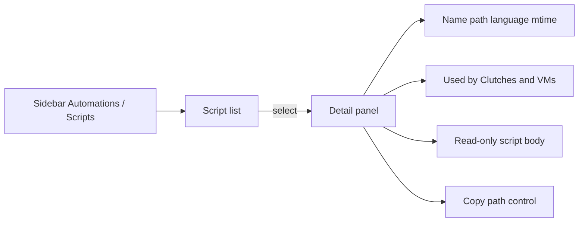

# Automations pane: parent epic + Scripts MVP

## Decisions (locked)

- **#13 becomes the parent/origin** for Automations visibility work; implementation lands against a new child issue for Scripts MVP.
- **MVP scope (choice A):** filesystem inventory + Used-by + inline read-only view + copy path. No execution metrics. No `xdg-open`.
- **UI:** Events-style split pane (list left, inspect right — no drill-through).
- **Nav:** Automations becomes a Notifications-style group; first subnode is **Scripts**. Answer-file subnode is follow-on only (placeholder not required in MVP nav if we prefer a single live child — recommend **Scripts only** until the answer-file issue ships, matching how Notifications always had real children).
- **Answer-file inventory:** new follow-on issue (subnode name **Answer Files**, data under `automation/os_config/`).

## Issue graph (execute first, before code)

Rewrite [#13](https://github.com/dustinestes/Hatchery/issues/13) as parent epic summarizing Automations discovery/audit; mark original detailed acceptance criteria as split out.

Create child/follow-on issues (all `feat`, link to #13):

| New issue | Scope |
|-----------|--------|
| **Scripts inventory MVP** | Subnav + Events-style pane: name, relative path, language, mtime, Used-by, inline viewer, copy-path |
| **Script execution insights** | Avg runtime / success rate / VMs-ran from `hatch_vm_scripts`; must call out archive purge (active-session-only unless retention changes) |
| **Open script in host editor** | `xdg-open` handoff + graceful degrade (path shown) |
| **Answer Files inventory** | Automations subnode; inventory + inspect for `automation/os_config/`; mirror Scripts patterns |

Do **not** merge scope with [#70](https://github.com/dustinestes/Hatchery/issues/70) (Media) or [#151](https://github.com/dustinestes/Hatchery/issues/151) (missing-script alerts); mention them as related only.

Branch/PR for the first implementable child: `feat/{child}-automation-scripts-pane`.

## Scripts MVP — implementation

### Nav shell

Convert Automations in [`templates/ui/base.html`](templates/ui/base.html) from a flat `sidebar-item` to `sidebar-item--group` (same pattern as Notifications ~L122–142):

- Parent link → Scripts route (or `/automation` redirecting there)
- Subnav: **Scripts** only for now
- `active` / `open` / `aria-expanded` when `active_pane` is the scripts pane id (e.g. `'automation'` or `'automation_scripts'`)
- Reuse existing collapsed-rail flyout behavior already wired for groups

### Routes / data

In [`hatchery.py`](hatchery.py):

- Keep `/automation` as entry; either render Scripts or `redirect` to `/automation/scripts` (prefer explicit `/automation/scripts` + redirect for future Answer Files sibling).
- Enrich scan beyond name-only `_scan_dir`: new helper returning `{name, relative_path, language, modified_at}` for files under `automation/scripts/` (flat dir, matching today’s scan).
- Language map by extension (`.ps1` → PowerShell, `.sh` → Shell, else extension or “Unknown”).
- Server-side **Used-by**: load Clutches via existing clutch helpers; map script basename → `[{clutch, vm}, …]` (handle string and `{name: …}` automation forms in [`lib/clutch.py`](lib/clutch.py)).
- `GET /api/automation/scripts/<name>/content` — read-only text; sanitize with `Path(name).name` + resolve under `automation/scripts/`; size cap; UTF-8 with replacement. Fix the same basename discipline on the existing params route if touched.
- No stats endpoint. No open-in-editor endpoint.

### UI ([`templates/ui/automation.html`](templates/ui/automation.html) or new `automation_scripts.html`)

Mirror [`templates/ui/events.html`](templates/ui/events.html) layout (`.events-layout` patterns / shared or copied class names under an automations prefix):

- Left: selectable script rows (keyboard + visible focus); empty state if no scripts.
- Right: metadata, expandable/list Used-by, `<pre>` (or equivalent) of content loaded on select; stub until selection (“Select a script to inspect”).
- Trailing **copy path** control: `aria-label` / `title` (“Copy file path”); `navigator.clipboard.writeText(absolute_or_data_relative_path)`; brief non-color-only confirmation (text / `aria-live`). Prefer absolute path under the configured data dir so paste-into-editor works.
- Update pane subtitle to Scripts-only wording (drop “OS answer files” from this view).
- A11y: labeled controls, Escape consistent with existing pane patterns, no color-only status.

### Tests / docs

- Update stub assertion in [`tests/test_app.py`](tests/test_app.py); add coverage for scripts page, content API (incl. traversal rejection), Used-by mapping with string + object automation entries.
- Light doc touch if Automations pane is described in CONTRIBUTING / `.hatchery/docs/automations.md` — only if those already claim a stub or answer-file+scripts UI.

## Explicitly out of this PR

- Execution metrics (new issue; note purge in [`lib/hatch.py`](lib/hatch.py) `_purge_session_children`)
- `xdg-open` / host editor
- Answer Files subnode + `os_config` inventory
- Media pane (#70)
- Clutch missing-script alerts (#151)

## Suggested PR order after issue hygiene

1. Issue rewrite + create four issues (or three follow-ons + one MVP child).
2. Single focused PR: Scripts MVP (nav group + pane + content API + copy path + tests).
3. Later PRs map 1:1 to follow-on issues.
