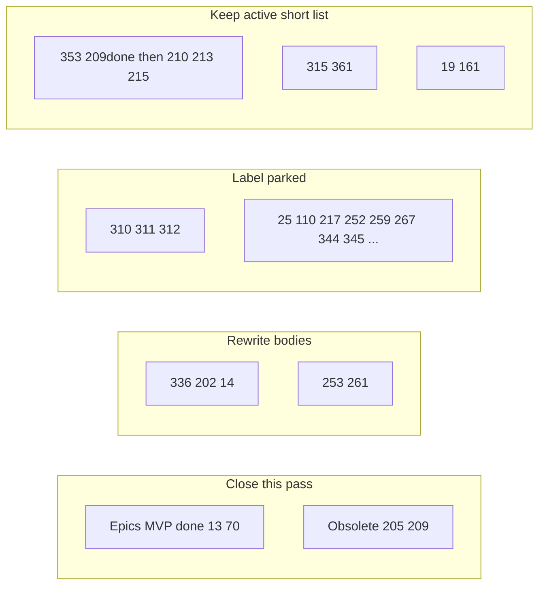

# Backlog triage wrangle (~61 open)

## Snapshot

About **61** open issues (June–Sep 2026). Much of the sprawl is **already shipped under child PRs** while parent epics stayed open, plus early ideas that predate SQLite settings, Library plane, Nest factory, CLI, and ADR-0021.

**Default aggressiveness for this pass:** close only **clear** done/obsolete; **rewrite** stale epic/planning bodies; **park** (new label + comment, keep open) the long tail. No mass `wontfix` closes of real future work unless you later approve a second pass.

## Bucket A - Close now (done or obsolete)

| Issue | Action | Why |
|---|---|---|
| [#13](https://github.com/dustinestes/Hatchery/issues/13) Automations epic | Close | Discovery MVP shipped (Scripts inventory + Library Content). Children #175–#177 remain open. |
| [#70](https://github.com/dustinestes/Hatchery/issues/70) Media epic | Close | Discovery MVP shipped (ISO/VirtIO + Library Content). Children #187–#189 remain open. |
| [#205](https://github.com/dustinestes/Hatchery/issues/205) DB/secrets readiness | Close obsolete | SQLite settings SoR already landed; crypto stays on [#110](https://github.com/dustinestes/Hatchery/issues/110). |
| [#209](https://github.com/dustinestes/Hatchery/issues/209) Nest transport helpers | Close done | `lib/nest_transport.py` shipped via #218/#220; Hyper-V consumption is #213. |

Each close comment: one line “superseded by / shipped in …” + pointer to remaining children.

## Bucket B - Rewrite (keep open, fix mental model)

| Issue | Rewrite to say |
|---|---|
| [#336](https://github.com/dustinestes/Hatchery/issues/336) CLI epic | Phases 0–4a **done**; open = #353 mutate, #344 settings (parked). Acceptance checkboxes updated. Link ADR-0021. |
| [#202](https://github.com/dustinestes/Hatchery/issues/202) Nest epic | Phase A foundation **done**; open focus = B/C (#210→#212, #213/#214, #215). Drop stale “#23 after Nest API” framing where CLI inspect already shipped. |
| [#14](https://github.com/dustinestes/Hatchery/issues/14) Snapshot/health | Provider APIs exist; remaining = UI/API + guest health; retire Freeze/Thaw/Chirp wording. |
| [#253](https://github.com/dustinestes/Hatchery/issues/253) Settings watch | Scope to remaining `app_settings` only; YAML is not Library SoR (ADR-0015/0017). Or park if you prefer not to pursue. |
| [#261](https://github.com/dustinestes/Hatchery/issues/261) Settings IA | Drop Settings→Library assumptions (ADR-0016); Connections live under Library. |

## Bucket C - Park (new label `parked` + comment; stay open)

Create triage label `parked` (description: deferred; not in active focus). Apply + short comment “Parked: revisit after …” to reduce noise without deleting ideas:

- Forge breadth: #310, #311, #312 (after GitHub demand / catalog)
- Distribution / auth later: #25, #110, #259
- Nest later: #211, #212, #216, #267, #345, #252
- CLI later: #344
- Guests later: #217
- Audit / DB size: #164, #169
- Misc long-tail hatch polish that is not sequencing critical: leave open **without** park unless they clutter filters; prefer park only when they compete for attention with Nest/CLI focus

Rough effect: open count stays ~similar, but **filterable** “active” set shrinks.

## Bucket D - Active focus (what actually matters next)

Ordered against current north stars (ADR-0021 embeddable plane + Nest remoting):

1. **[#353](https://github.com/dustinestes/Hatchery/issues/353)** CLI mutate (operator verbs)
2. Nest remoting path: **#210** UTM and/or **#213** Hyper-V + **#214** credentials + **#215** remote hatch (pick one hypervisor track; do not parallelize all)
3. ~~**[#315](https://github.com/dustinestes/Hatchery/issues/315)** Hatchery Library (Library demo)~~ **done** - [dustinestes/Hatchery-Library](https://github.com/dustinestes/Hatchery-Library)
4. **[#361](https://github.com/dustinestes/Hatchery/issues/361)** Cleaners (Library residue / DB hygiene)
5. Standing constraints: **#161** a11y (don’t schedule as a big bang; don’t regress), **#19** Clutch instances when hatch product depth needs it

Everything else stays parked or “when it hurts.”

## Execution (after you approve this plan)

1. Open a tracking issue `chore: backlog triage Sep 2026` (`chore` + `planning`) with the matrix and link this plan.
2. Add label `parked`.
3. Batch: close Bucket A → edit Bucket B bodies → label+comment Bucket C.
4. Comment on #336 / #202 with the shortened child tables.
5. Optional follow-up PR: none required (issue hygiene only). No ADR unless you want a “backlog hygiene” note (skip; not architecture).

## Out of scope this pass

- Implementing any product features
- Closing forge/provider ideas as wontfix
- Full rewrite of every July hatch-polish issue
- Creating many milestones (one `parked` label is enough)

## Success metric

- Clear **close** set (~4) done
- Epics **#336 / #202 / #13 / #70** no longer lie about MVP status
- You can list open issues with `-label:parked` and see a manageable active set (~20–25) instead of 61 equally loud ideas
