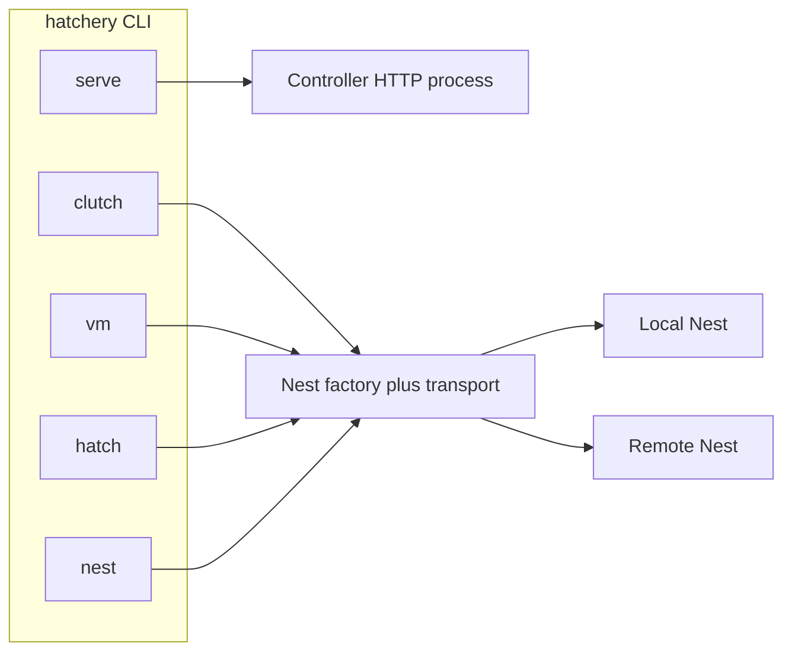

# CLI surface planning and ADR (#343)

## Context

- Planning child filed: [#343](https://github.com/dustinestes/Hatchery/issues/343) (`feat` + `planning`). Still needs GitHub **sub-issue** link under [#336](https://github.com/dustinestes/Hatchery/issues/336).
- Today: no `[project.scripts]`; contributors run `uv run gunicorn hatchery:app`; [`hatchery.py`](hatchery.py) has a debug `app.run` under `__main__` only. Config bootstrap is [`lib/config.py`](lib/config.py) (`data_dir` in YAML; rest in SQLite). Nest work must go Nest id → factory ([ADR-0003](docs/adr/0003-nest-registry-provider-factory.md)).
- Next free ADR number: **0013** ([docs/adr/README.md](docs/adr/README.md)).

## Locked design (for the ADR)

These are the decisions #343 exists to accept; treat as the proposed ADR body unless planning discussion revises them before the ADR PR.

| Decision | Choice |
|---|---|
| Entrypoint | **One** console script `hatchery` (multi-command). No `hatchery-vm` binary. |
| Parser | **stdlib `argparse`** (no new CLI framework dependency). |
| Packaging | `[project.scripts] hatchery = "…:main"` in [`pyproject.toml`](pyproject.toml); long-term name toward [#273](https://github.com/dustinestes/Hatchery/issues/273). |
| Globals (launch) | `--data-dir`, and for `serve` also `--host` / `--port`. **Session-only overrides**: these flags never write Settings / bootstrap. Precedence: CLI > bootstrap/config > defaults. |
| Settings mutation | **Out of #22 / ADR-0013 for now.** Long-term, a separate operator concern (e.g. `hatchery settings get\|set` or reuse Settings export/import) may persist keys once Settings stabilize. Do not overload launch flags into “also write config.” Sandboxes and services need ephemeral overrides without mutating the laptop’s real Settings. |
| Launch | `hatchery serve` configures runtime `data_dir` / bind, initializes missing data dir, then runs the Controller (gunicorn-compatible app object; contributor `gunicorn hatchery:app` remains valid when env/CLI overrides are applied the same way). |
| Operator execution | **In-process**: load registry from `--data-dir`, Nest id → factory / transport (same plane as UI). Does **not** require a running Controller. Aligns with ADR-0003; Remote Nest uses Nest transport, not “SSH from the CLI inventively.” |
| Inspect / list | **Yes, under #23** (not #22): `nest list`, `vm list`, clutch list/show, and similar read-only investigation against stored state + Nest inventory. First operator slice can prioritize inspect before mutating hatch/power if that lands faster. |
| Nest targeting | `--nest <id>` when required; if exactly **one** Nest is registered, it may be the default; if zero or many, require `--nest` (or fail with empty-registry guidance once [#266](https://github.com/dustinestes/Hatchery/issues/266) lands). |
| Phase cut | **#22** ships: entrypoint + globals + `serve` only. Do **not** register stub operator subcommands that only print “not implemented.” **#23** adds `clutch` / `vm` / `hatch` / `nest` (including list/inspect) on the same parser. |
| Verbs | Hatchery product words only (Hatch, Cull, Snapshot, Revert, health / Test Nest). No Brood / Freeze / Thaw / Chirp. |
| Non-goals (this planning / ADR-0013) | [#25](https://github.com/dustinestes/Hatchery/issues/25) launcher; [#273](https://github.com/dustinestes/Hatchery/issues/273) formulas; replacing the web UI; full operator MVP in the same PR as `serve`; **Nest-side async job agent / event catch-up protocol** (see below). |

**ADR split:** one ADR is enough for the CLI product shape: `docs/adr/0013-hatchery-cli-launch-and-operator.md`. Index in [`docs/adr/README.md`](docs/adr/README.md). Status `Accepted` in the PR that lands it.

### Explicitly not in ADR-0013: Nest async job / offline hatch

A Nest that receives a **self-contained hatch payload**, runs without a persistent SSH session, and later **replays events/status** to the Controller when connectivity returns is a strong direction for resilient **Remote Nest** orchestration. It is **Nest plane / hatch control-plane architecture**, not CLI packaging.

- Belongs with Nest transport, Nest cache ensure ([ADR-0007](docs/adr/0007-library-nest-content-planes.md)), hatch sessions, and Events ([ADR-0008](docs/adr/0008-alerts-events-audit-separation.md)), likely under epic [#202](https://github.com/dustinestes/Hatchery/issues/202) / hatch follow-ons (e.g. related to [#215](https://github.com/dustinestes/Hatchery/issues/215)).
- Needs its **own planning + ADR** when ready (job envelope, Nest agent, at-least-once event delivery, Controller reconciliation).
- CLI and UI should both call the **same** Controller/Nest orchestration APIs once that model exists; the CLI must not invent a parallel SSH hatch path.

Do **not** expand #343 / ADR-0013 to design that protocol.

## Work sequence

1. **Housekeeping (Agent mode)**  
   - `addSubIssue` #343 under #336.  
   - Update [#336](https://github.com/dustinestes/Hatchery/issues/336) phase table: **Phase 0 = #343** (planning + ADR), then 1=#22, 2=#266, 3=#337, 4=#23.  
   - Keep Clockify on #343 / #336 while planning; do not stop on ADR PR alone.

2. **Land ADR (#343)**  
   - Author ADR-0013 with Context / Decision / Consequences / Alternatives (rejected: second binary; HTTP-only operator client; typer/click for v1; mutating Settings via launch flags; stuffing Nest async-agent design into the CLI ADR).  
   - Note in Consequences: future `settings` mutation commands and Nest async job ADR are follow-ons, not contradicted.  
   - Link issues #336, #343, #22, #23, #273, ADR-0003, ADR-0005.  
   - PR: `docs: accept ADR-0013 Hatchery CLI launch and operator (#343)` (prefer **docs** if ADR-only).

3. **Update child issues from the ADR**  
   - [#22](https://github.com/dustinestes/Hatchery/issues/22): match ADR (`hatchery serve`, argparse, session overrides, no operator cmds, no Settings writes).  
   - [#23](https://github.com/dustinestes/Hatchery/issues/23): match ADR (in-process factory, Nest targeting, **list/inspect** + lifecycle subcommands).  
   - Optionally file a **parked** follow-on under #202 (not #336) for “Nest hatch job agent + async event catch-up” if you want the idea tracked without blocking CLI.  
   - Close #343 when ADR is merged / Accepted.

4. **Begin Phase 1 (#22)** (separate PR after or with ADR if skeleton is tiny)  
   - Runtime override hook in [`lib/config.py`](lib/config.py).  
   - CLI module (e.g. `lib/cli.py` or `hatchery_cli/`) with `serve`.  
   - `[project.scripts]`.  
   - Tests for parse + precedence.  
   - Docs touch: CONTRIBUTING quick start mentions `hatchery serve` alongside gunicorn.

## Success criteria

- ADR-0013 Accepted and indexed.  
- #22 / #23 / #336 text match the ADR.  
- #343 closed.  
- Clear green light to implement #22 without re-opening entrypoint or operator-execution debates.
