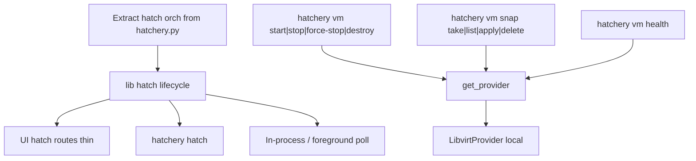

# CLI mutate: full #353 (extract then land)

## Answer: hatch prework first?

**Yes.** Extract orchestration from [`hatchery.py`](hatchery.py) into a shared lib first, then wire CLI on the same path. Local Nest + libvirt is enough. Remote Nest VM/hatch ops stay clear `UnsupportedProviderError` until providers/#345.



## Verb decisions (locked)

### Drop Cull on the CLI

CLI VM remove uses **`destroy`** (`destroy_vm`). Update ADR-0013: CLI prefers universal lifecycle words (`destroy` not `cull`). Keep Hatch / Nest / Clutch.

### Snap family

```bash
hatchery vm snap take   <vm-name> --label <id>
hatchery vm snap list   <vm-name>
hatchery vm snap apply  <vm-name> <label>
hatchery vm snap delete <vm-name> <label>
```

Maps to `create_snapshot` / `list_snapshots` / `revert_snapshot` / `delete_snapshot`. Help: “VM state snapshot (Hyper-V calls this a checkpoint).” Provider method names stay snapshot-*.

### Power + health + hatch

| CLI | Maps to | Notes |
|---|---|---|
| `start` / `stop` / `force-stop` / `destroy` | provider power / destroy | |
| `list` | `list_vms` | already shipped |
| `health` | `get_vm_ip` + TCP WinRM `5985` | **ships in #353; does not wait on #14** |
| `hatch --clutch …` | extracted hatch orch + foreground poll | |

**Not in this PR:** Pause / Resume.

### Guest health vs #14 (clarified)

**Nothing in `hatchery vm health` depends on [#14](https://github.com/dustinestes/Hatchery/issues/14).**

[#14](https://github.com/dustinestes/Hatchery/issues/14) is early **UI** work with retired brand verbs (Freeze / Thaw / Chirp). Provider snapshot APIs already exist; Chirp was “WinRM ping in the UI.”

| Piece | Where it lives now |
|---|---|
| Snap take / list / apply / delete (operator) | **#353 CLI** |
| Guest health = IP + WinRM TCP (operator) | **#353 CLI** (same idea as hatch `_check_winrm`; extract to shared helper) |
| Deep UI controls for VMs | **new epic** (below), not #14 |
| Richer guest health later | optional child under that epic if needed |

“Thin” here only means: responsive / unreachable via TCP (and IP), not guest-agent CPU/disk/mem. It is complete enough for v1 operator CLI.

## Implementation order

1. **Extract** hatch create + sync/provision (+ shared WinRM TCP helper) out of `hatchery.py`.
2. **`hatchery hatch`** with foreground poll (no `serve` required).
3. **`hatchery vm`** power + `snap *` + `health`.
4. **Docs / ADR-0013** verb row.
5. **Tests** (mocked) + manual local libvirt smoke.

## Issue hygiene (with this work)

### Close #14 as superseded

On implement / PR open: comment and **close #14**:

- Snapshot provider methods already shipped; operator snap + health land in **#353**.
- Freeze / Thaw / Chirp naming is retired (product: Snapshot / Revert / health; CLI: `snap` / `health`).
- Remaining **UI** for deep VM controls moves to the new **top-level VMs** epic (link it). Do not leave #14 open competing with #353.

Not “#14 blocked health”; #14 is obsolete framing.

### File: top-level VMs UI epic (new)

No existing issue matches this. File a **feat epic** (not part of #353 code):

- **Top-level sidebar nav item “VMs”**, placed **after Clutches** (sibling, not nested under Clutches). Order should match dashboard tile order.
- **Pane:** all VMs across Nests, with filters for search, Nest, Clutch, OS, state (and other obvious facets as needed).
- **Chrome:** same inventory pattern as Clutches / Media / Scripts (topbar title, toolbar/filters, list+detail split - see inventory chrome work / #391 lineage).
- **Detail / panel:** deeper controls (power, snap, health, destroy, session/automation context) - the home for operator-grade VM actions.
- **Nests pane** stays Nest-centric inventory: what is hatched on each Nest, state, light metadata - not the deep per-VM control surface.
- Point at #353 for CLI/provider verbs already available.

**Children of that epic (file with the epic):**

1. **VMs pane MVP** - nav + inventory chrome + filters + detail wired to Nest factory (reuse #353 paths).
2. **Apply inventory chrome to Nests** - bring Nests pane up to the same chrome standard as Clutches / Media / (new) VMs. Separate issue; easy to lose otherwise.
3. **Nest / VM resource metrics** - per-VM disk/mem/CPU; list rollup of Nest consumption; product question in the body: **configured** allocation vs **actual** usage (e.g. dynamic memory: 4 GB configured ≠ 4 GB used). Needs Nest inspection / provider read APIs beyond `list_vms` status. Not covered by CLI `health`.

## PR / issue hygiene for #353 itself

- Branch: `feat/353-cli-mutate`
- PR **Closes #353**; comment closes #14 as superseded (with epic link once filed).
- ADR-0013 verb clarification in the same PR.

## Out of scope for the #353 PR

- Remote Nest VM/hatch, Nest job agent (#345)
- Top-level VMs UI epic implementation (nav, filters, chrome, detail)
- Nests inventory-chrome parity issue
- Nest / VM resource metrics / rollup implementation
- Global UI rename of “Cull” (CLI uses `destroy`; UI align in the VM epic if desired)
- Settings CLI (#344)
- Pause / Resume
