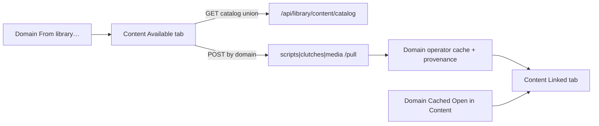

# Content Available catalog (#392)

## Locked product shape

- **Chrome:** Library → Content gets **Available | Linked** tabs (same `.inventory-tabs` / `bindInventoryTabs` a11y as Cached | Library). Labels are Available / Linked, not Cached / Library.
- **Default tab:** bare `/library/content` → **Linked** (today’s lifecycle pane). `?tab=available` → Available. Existing `?domain=&name=` (± `media_target`) → **Linked** and select (ignore `tab` when `name` is set).
- **Catalog:** new `GET /api/library/content/catalog` unions scripts + clutches + media, stamps each row with `domain`, keeps media `target`, runs existing `annotate_cached` per domain. No new pull semantics.
- **Pull:** reuse `POST /api/library/{scripts|clutches|media}/pull` via domain-aware routing in the browser JS.
- **From library…:** domain panes navigate to `/library/content?tab=available&domain=scripts|clutches|media` (not Connections).
- **Domain in-pane Library tabs:** remain transitional this PR; file a tiny follow-on issue for removal once Available is the default shop surface.

## Implementation

### 1. Content chrome ([templates/ui/library_content.html](templates/ui/library_content.html))

- Add tab strip (new thin partial `_library_content_tabs.html`: `library-content-tab-available` / `-tab-linked`, panels `-panel-available` / `-panel-linked`).
- Move today’s Linked inventory (filters + split + detail JS) into **Linked** panel.
- **Available** panel: library browser markup. Prefer extending [`_library_browser_panel.html`](templates/ui/_library_browser_panel.html) with optional `panel_id` / skip outer Library-tab coupling, plus a **Domain** filter select (`{prefix}-lib-filter-domain`) and a Domain table column. Prefix: `library-content` → ids `library-content-lib-*`.
- Wire `bindInventoryTabs` for Available ↔ Linked; on show Available call `browser.load()`.

### 2. Union catalog API ([hatchery.py](hatchery.py) + thin helper in [lib/library.py](lib/library.py))

- `GET /api/library/content/catalog` (library-enabled gated like other catalog routes).
- Build items by calling existing `catalog_scripts` / `catalog_clutches` / `catalog_media` (+ annotate), set `domain` on each row.
- Media: catalog all targets (same as media API with no `target` filter today).
- Optional query `domain=` can pre-filter server-side; client filter still required for UX.

### 3. Domain-aware browser JS ([static/app.js](static/app.js))

Extend `hatchery.bindLibraryBrowser` (keep domain panes working):

- Accept `catalogUrl` pointing at the union API **or** keep single-URL load.
- Add optional `filterDomain` control + Domain column when rows have `domain`.
- Pull: if `opts.pullUrls` map `{ scripts, clutches, media }` is set, POST to the map entry for `row.domain`; for media merge `{ target: row.target }` into the body (instead of static `pullExtra` only).
- `bindLibraryBrowserByPrefix` gains optional domain filter element + `pullUrls`.
- After successful pull on Content: reload Available catalog; optionally hint to switch to Linked (toast is enough; no forced tab switch).

### 4. Route / deep-links

- [`library_content_pane`](hatchery.py): pass `initial_tab` from `tab` / `view` query (`available` | `linked`).
- Linked JS already handles `initial_domain` / `initial_name` / `initial_media_target`; Available JS sets domain filter when `tab=available` and `domain` present (even without `name`).
- Update `onFromLibrary` in [automation_scripts.html](templates/ui/automation_scripts.html), [clutches.html](templates/ui/clutches.html), [media_inventory.html](templates/ui/media_inventory.html).

### 5. Docs

- Rewrite Content / From library… / Inventory browse sections in [docs/library.md](docs/library.md) for Available + Linked; mark domain Library tab as transitional pending follow-on.
- Short Consequences note on [ADR-0016](docs/adr/0016-library-operator-plane.md) (Available shipped on Content; domain tabs still transitional). No new ADR unless implementation diverges from this plan.

### 6. Tests ([tests/test_app.py](tests/test_app.py))

- Content HTML: Available | Linked tab ids; Available browser ids; Linked filter ids unchanged.
- Catalog API: returns items with `domain`; forbidden when Library off.
- Smoke: From library… href targets Content Available with domain.
- Optional: pull one script via existing pull API still records provenance (reuse existing pull tests if present; don’t re-test all transport types).

## Out of scope (per issue)

- Soft-disable / excise (#379)
- Dual file tree under `data-dir/library/` for pulled files
- Removing domain Library tabs in this PR (follow-on)
- Connections admin changes
