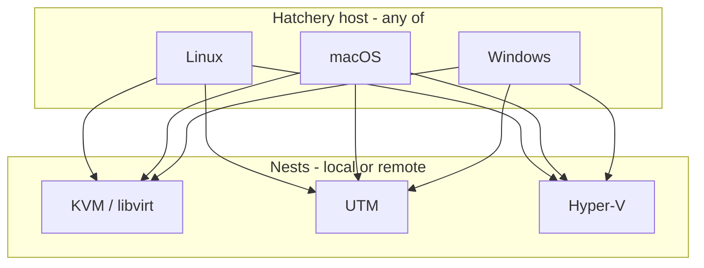

# Cross-platform & remote Nests epic

## Product goal

**Any OS as Hatchery host ↔ any OS as Nest (local or remote).** Personal preference may start with Mac host + UTM local + Hyper-V remote, but colleagues need the inverse (Windows host + Mac Nest). Development preference: prove remoting from a **Linux Hatchery host** to Mac and Windows Nests first, then harden each OS as a host.

Local Nest = hypervisor on the same machine as Hatchery. Remote Nest = hypervisor on another machine, reached over a Nest transport (e.g. WinRM for Hyper-V; TBD for remote UTM/libvirt). Guest provisioning (WinRM/SSH into the VM) stays separate from Nest transport.

## What exists today

- Single local Ubuntu KVM Nest; [`lib/providers/libvirt.py`](lib/providers/libvirt.py) only
- [`lib/providers/hyperv.py`](lib/providers/hyperv.py) empty; **no UTM**
- Nest is a dead `"local"` string in DB/UI; `_provider()` hard-wires libvirt
- CI ([`.github/workflows/test.yml`](.github/workflows/test.yml)) is **ubuntu-latest only**
- Milestone **v2 — Multi-Nest and expanded guest support** names multi-nest + Hyper-V but has no Nest/provider implementation issues

## Existing issues — decisions (locked)

| Issue | Decision |
|---|---|
| [#14](https://github.com/dustinestes/Hatchery/issues/14) Freeze / Thaw / Chirp | **Do before / early** — observability needed for remote Nests |
| [#22](https://github.com/dustinestes/Hatchery/issues/22) app CLI | **Do early** — portable entrypoint for every host OS |
| [#25](https://github.com/dustinestes/Hatchery/issues/25) Linux launcher | **Expand** into cross-platform install/launcher (detect OS; install `.desktop` / macOS app or alias / Windows shortcut or Start-menu entry). Python remains a host requirement |
| [#13](https://github.com/dustinestes/Hatchery/issues/13) Automations epic | **Not a gate**; add a note that children must stay cross-platform (especially [#176](https://github.com/dustinestes/Hatchery/issues/176) — no `xdg-open`-only) |
| [#146](https://github.com/dustinestes/Hatchery/issues/146) Settings section navigation | **Milestone + early** — Nest/Security/Database settings will grow; tab/sidebar IA before dumping new settings into one scroll |
| [#110](https://github.com/dustinestes/Hatchery/issues/110) encrypted credentials / auth | **Enterprise must** — schedule early enough that Nest secrets never land as long-lived plaintext |
| [#50](https://github.com/dustinestes/Hatchery/issues/50) host capacity checks | **Defer** — prove cross-platform + remoting first |
| [#161](https://github.com/dustinestes/Hatchery/issues/161) a11y, [#164](https://github.com/dustinestes/Hatchery/issues/164) audit, [#23](https://github.com/dustinestes/Hatchery/issues/23) node CLI | **Remove from this milestone** — not required for cross-platform/remoting (a11y remains a standing non-regression rule) |
| Linux guests | **Phase D** — no immediate need |

**Milestone action:** Rename v2 → **Cross-platform & remote Nests**; reassign issues per table; file new epic children below.

## Design principles (agent + human)

1. **Cross-platform is first class** — every feature/change asks: Linux / macOS / Windows host? Local vs remote Nest? Document gaps in the provider matrix; do not bake apt/`xdg-open`/systemd as the only path.
2. **Testing is first class** — multi-OS CI as early as possible; PR acceptance keeps lint + tests + coverage bar. Encode in [`.cursor/rules/`](.cursor/rules/) (new rule or extend [`python-style.mdc`](.cursor/rules/python-style.mdc) + [`hatchery-core.mdc`](.cursor/rules/hatchery-core.mdc)).
3. **Reusable seams** — Nest registry, provider factory, capability reporting, Nest transport helpers, settings sections — prefer shared modules over per-provider copy/paste.
4. **Settings grow under [#146](https://github.com/dustinestes/Hatchery/issues/146)** — new Nest/Security/Database knobs land in sections, not one long list.

## SQLite vs Postgres (recollection)

**Encrypted secrets do not require Postgres.** Application-layer encryption (key from env / OS keychain) works with SQLite and matches [#110](https://github.com/dustinestes/Hatchery/issues/110) Option A and current docs ([`.hatchery/docs/schema/database.md`](.hatchery/docs/schema/database.md)).

Postgres becomes interesting for **deployment shape**, not encryption:

- Multiple Hatchery processes sharing one DB
- Networked multi-user / enterprise install
- Stronger concurrent writers than SQLite’s single-writer model

**Plan:** Keep **SQLite as the default** (prior decision stands). Early in this milestone, file a **DB readiness** issue that (1) confirms app-layer crypto on SQLite for Nest + guest secrets, (2) introduces a thin connection/repository boundary so a later optional Postgres backend is possible without rewriting Nest code, (3) does **not** mandate migrating to Postgres before Phases A–C. Revisit Postgres only if multi-instance or shared-DB requirements appear.

---

## Phased work

### Phase 0 — Gates before meaningful Nest/provider code

Do these before (or in parallel with the first Nest factory PR), so CI and settings IA are not bolted on after the fact.

1. **chore/feat: multi-OS CI matrix** — expand GitHub Actions beyond `ubuntu-latest` to include `macos-latest` and `windows-latest` for the portable test suite (pytest that does not need a real hypervisor). Hypervisor integration tests stay marked/optional. Keep coverage gate; document “what runs where” in CONTRIBUTING / tests docs. **First-class testing** called out in Cursor rules.
2. **feat: [#146](https://github.com/dustinestes/Hatchery/issues/146) Settings section navigation** — General / Security / Database / Orchestration / (soon) Nests — so Nest connection settings have a home.
3. **feat: [#22](https://github.com/dustinestes/Hatchery/issues/22) CLI surface** — `--data-dir`, `--host`, `--port`; OS-agnostic.
4. **feat: expand [#25](https://github.com/dustinestes/Hatchery/issues/25)** — install/launcher script: detect platform, place appropriate shortcut/launcher; Python required on all hosts.
5. **docs: provider & feature support matrix** — living document (e.g. `.hatchery/docs/providers.md`): rows = Hatchery features/components (Hatch, Cull, Freeze/Thaw, Chirp, IP, send-key, answerfiles, guest WinRM provision, media layout, …); columns = providers (libvirt, UTM, Hyper-V) × local/remote; cells = works / does not / caveat. Updated whenever a provider lands or gaps change.
6. **chore/feat: DB & secrets readiness** — SQLite default + thin DB boundary; spike/plan for [#110](https://github.com/dustinestes/Hatchery/issues/110) crypto on SQLite; optional Postgres path documented, not required.
7. **feat: [#14](https://github.com/dustinestes/Hatchery/issues/14) Freeze / Thaw / Chirp** — wire shared lifecycle + Chirp UI before remote Nest work depends on observability.
8. **docs/chore: Cursor rules** — cross-platform first class; testing/CI first class; modularity reminders.

Also: comment on [#13](https://github.com/dustinestes/Hatchery/issues/13) / [#176](https://github.com/dustinestes/Hatchery/issues/176) that open-in-editor must be portable (`xdg-open` / `open` / `start` or equivalent).

### Phase A — Nest foundation

9. **epic: Cross-platform and remote Nests** (parent) — matrix goal, phases, links to children.
10. **refactor: provider factory + Nest-aware routing** — Nest id → `BaseProvider`; all list/hatch/power/snapshot/IP paths use factory; stop hard-wiring `LibvirtProvider`.
11. **feat: Nest connection registry + Settings (Nests section)** — CRUD Nests (name, provider type, local vs remote, endpoint, credential refs); Chirp connectivity; errors in UI.
12. **feat: portable host requirements** — replace apt/dpkg-only [`lib/requirements.py`](lib/requirements.py) with per-OS / per-provider checks.
13. **refactor: reusable Nest transport helpers** — shared remote exec/session patterns where Hyper-V (and later remote libvirt/UTM) can plug in without duplicating WinRM/SSH boilerplate; keep guest provision in [`lib/provision.py`](lib/provision.py).

### Phase B — UTM Nest (Mac hypervisor)

14. **feat: UTM provider** — [`lib/providers/utm.py`](lib/providers/utm.py); implement `BaseProvider`; update support matrix for every method/feature.
15. **feat: UTM guest paths / capabilities** — Windows ARM, macOS guests; capability flags where Autounattend/WinRM do not apply; Clutch/OS-type honesty in UI.
16. **feat: remote UTM Nest (as needed)** — if colleagues run Hatchery on Windows/Linux managing a Mac Nest; transport TBD (document in matrix; may follow Hyper-V remoting patterns).

### Phase C — Hyper-V Nest (Windows hypervisor)

17. **feat: Hyper-V provider** — flesh out [`hyperv.py`](lib/providers/hyperv.py) for **local and remote** (WinRM + PowerShell from any Hatchery host).
18. **feat: Nest credentials + [#110](https://github.com/dustinestes/Hatchery/issues/110)** — encrypt Nest and guest secrets at rest; UI auth as needed for enterprise.
19. **feat: Hatch to remote Nest** — media/answerfile strategy when media lives on the Nest host; Clutch target Nest field.
20. **docs: update README support table + CONTRIBUTING** for full host×Nest matrix.

### Phase D — Later

- Linux guests on KVM (cloud-init / preseed / kickstart)
- [#23](https://github.com/dustinestes/Hatchery/issues/23) node CLI once Nest API is stable
- [#50](https://github.com/dustinestes/Hatchery/issues/50) Nest-scoped capacity checks
- Optional Postgres backend if multi-instance demand appears

---

## Suggested execution order

1. Milestone rename + issue triage (#161/#164/#23 off; #14/#22/#25/#110/#146 on; notes on #13/#176).
2. Cursor rules + multi-OS CI + provider matrix doc skeleton (Phase 0).
3. #146 Settings sections → #22 CLI → expanded #25 launchers.
4. #14 Chirp/Freeze/Thaw; DB/secrets readiness + #110 design that keeps SQLite.
5. Nest registry + provider factory (Phase A) — still only libvirt backend initially; inventory switches Nest.
6. UTM provider (Phase B) and Hyper-V local/remote (Phase C) in whichever order matches available hardware; update matrix every PR.
7. #110 encryption before Nest secrets are considered production-ready.

## Out of scope for MVP of this milestone

- JS framework rewrite (stay vanilla HTML/CSS/JS)
- Replacing guest WinRM provisioning for Windows guests
- Full feature parity on day one — matrix documents gaps honestly
- Mandating Postgres
- Linux guests / #50 / #23

## After plan approval (execution checklist)

- Rename GitHub milestone; move issues
- File parent epic + Phase 0–C children
- Comment on #13/#176/#25 with expanded scope
- Update Cursor rules
- Do not start provider implementations until Phase 0 CI + matrix skeleton exist
