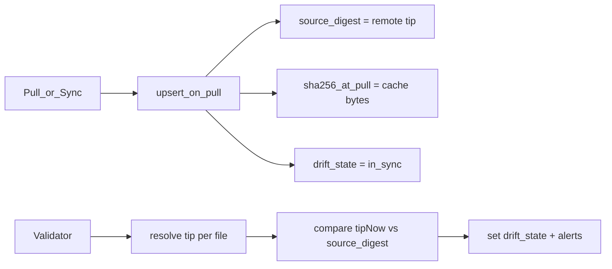
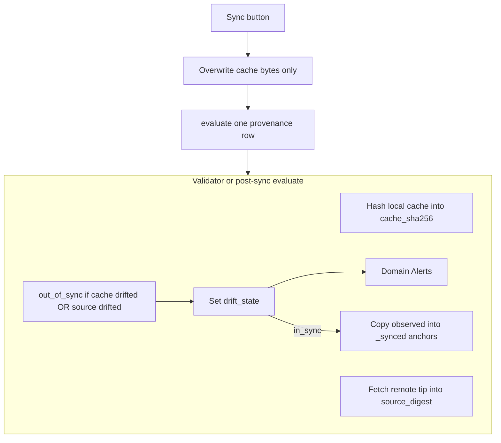

# Realign Library drift: bidirectional cache + source, pull-then-validate, forge rate limits

## How it works today (one-way only)



- Validator asks only: **did the source tip move since last pull?**
- It does **not** ask: **did the local cache bytes change since last pull?**
- Local edits to an attributed script stay invisible while the remote tip is unchanged.
- Sync also forces `in_sync` in the DB, which is the wrong owner of truth.

## Locked product intent: drift at the cache (both directions)

Operators care whether the **Cached file** still matches what Library sync last established. That fails if either side moves:

| Drift | Meaning |
|---|---|
| **Source changed** | Remote tip moved since last successful sync |
| **Cache changed** | Local file bytes changed since last successful sync |

Either condition ⇒ `out_of_sync` (same UI Sync affordance; Sync overwrites cache from source, then evaluate). No separate “locally modified” state in v1 unless copy needs it later (nav can still say “out of sync”).

## Target model



### Column naming (location-prefixed)

Prefix by side: **`cache_`** = operator-cache file, **`source_`** = Library tip. Bare name = last **observed** (evaluate); `_synced` = **anchor** at last successful sync/pull.

| Column | Role |
|---|---|
| `cache_sha256` | Observed: current Hatchery SHA-256 of cache bytes on disk (every evaluate) |
| `cache_sha256_synced` | Anchor: cache SHA at last successful sync/pull |
| `source_digest` | Observed: remote tip from this evaluate |
| `source_digest_synced` | Anchor: remote tip at last successful sync/pull |
| `source_digest_kind` | Tip alphabet (`sha256`, `git_blob`, `size_mtime`) for source_* digests |
| `drift_state` | Written only by evaluate / orphan paths, never by Sync alone |

**Rename map** from the current #308 schema ([`lib/db.py`](lib/db.py), [`docs/schema/database.md`](docs/schema/database.md), [`lib/library_provenance.py`](lib/library_provenance.py)):

| Old | New |
|---|---|
| `sha256_at_pull` | `cache_sha256_synced` |
| *(new)* | `cache_sha256` |
| `source_digest` | `source_digest_synced` |
| `last_source_digest` | `source_digest` |
| `source_digest_kind` | `source_digest_kind` (unchanged) |

Same PR: recreate/migrate the table (dev branch; no released migrate path required beyond whatever `_SCHEMA` / init already does). Update all Python/JS/docs references.

### Compare (type-agnostic + live match when possible)

After refreshing observed columns:

```text
cache_drifted  = cache_sha256 != cache_sha256_synced
source_drifted = source_digest != source_digest_synced

# When tip alphabet can describe cache bytes (not size_mtime):
live_mismatch  = content_identity(cache, source_digest_kind) != source_digest
#   sha256 tip  → cache_sha256 != source_digest
#   git_blob tip → git_blob(cache_bytes) != source_digest
#   size_mtime  → skip (tip is source metadata, not cache content)

out_of_sync = cache_drifted OR source_drifted OR live_mismatch
```

**Why all three:**

| Check | Catches |
|---|---|
| `cache_drifted` | Local edit since last sync (source tip unchanged) |
| `source_drifted` | Library tip moved since last sync (cache untouched) |
| `live_mismatch` | Current cache bytes do not match current source tip even if anchors look consistent (stale download, corrupt provenance, or both sides moved in compensating ways) |

Two-anchor alone is **not** enough for that third case: if `source_digest_synced` was advanced to a new tip while `cache_sha256_synced` still reflects old bytes (the CDN bug), both anchor compares can stay green while live cache ≠ live tip.

- **path / `size_mtime`:** only the two anchor checks (no live content↔tip equality).
- **forge / api / https content-addressable tips:** all three.
- Missing tip / rate limit ⇒ `unknown` (do not invent `in_sync`).
- Missing cache file ⇒ `out_of_sync` when source still resolves (Sync offered).

Pull integrity (adapter-level): refuse to finish a download that fails tip-vs-bytes before evaluate promotes anchors.

When evaluate concludes `in_sync` (including right after Sync): `cache_sha256_synced = cache_sha256`, `source_digest_synced = source_digest`.

## Sync button behavior

In [`api_library_cache_sync`](hatchery.py) / [`sync_row`](lib/library_drift.py):

1. Overwrite cache bytes from source only. Do **not** call `upsert_on_pull` that forces `in_sync`. Do **not** resolve alerts in the sync handler.
2. `evaluate_one(domain, name, …)` for that row (refresh both observed sides, set `drift_state`, promote anchors only if `in_sync`).
3. Reconcile that domain’s drift Alert from current DB counts.
4. Return `{ ok, sha256, drift_state, cache_drifted?, source_drifted? }` for UI.

Initial Library pull (create-only) may still write the provenance row with both anchors and observed equal and `in_sync`, or pull-then-evaluate once; same end state.

## Forge rate limits

Today [`GitHubAdapter.source_digest`](lib/library_forge/github.py) fetches **default branch + full recursive Trees** **per file**. That burns the Prelude budget fast.

**Pass-scoped tip cache:**

- One `_default_branch` + one recursive Trees call per forge connection per drift pass; map all rows for that connection from the index.
- Single-row evaluate after Sync: one Contents metadata call for that path’s tip when possible (avoid full tree for one file).
- On 403/429: mark affected rows `unknown`; no in-loop retry storm.

**Docs + UI:**

- [`docs/library.md`](docs/library.md): bidirectional drift (cache vs source); forge rate-limit guidance (PAT, interval, Trees cost).
- Settings hints on forge connection rows and `library_cache_drift` validator card.
- Cached UI: “out of sync” covers both directions; Sync remains the repair action (overwrite from Library).

## ADR

Revise [ADR-0012](docs/adr/0012-library-cache-provenance-drift.md) in the #308 branch:

- Bidirectional drift: cache bytes and/or source tip vs sync anchors
- Location-prefixed columns (`cache_*` / `source_*`); observed vs `_synced` anchors
- Observed columns refreshed by evaluate; anchors promoted only on `in_sync`
- Sync = pull bytes then evaluate (evaluate owns DB truth and alerts)
- Forge tip resolution batched per connection
- Keep: never download a body solely to hash for drift

## Tests

- Source-only: remote tip changes, cache untouched ⇒ `out_of_sync`, `source_drifted`
- Cache-only: edit local file, remote tip unchanged ⇒ `out_of_sync`, `cache_drifted`
- Live mismatch: anchors both “current” but cache bytes ≠ tip (sha256 or git_blob) ⇒ `out_of_sync`, `live_mismatch`
- Both clean ⇒ `in_sync`; anchors match observed; live match holds when tip is content-addressable
- Sync: pull then evaluate; no forced `in_sync` without evaluate; Alert via evaluate path
- GitHub: one Trees request for multiple paths in one `run_drift_pass`
- 429 ⇒ `unknown`

## Out of scope

- Separate UI badge for “locally edited” vs “source newer” (same Sync action for v1)
- Cross-interval ETag tip cache (follow-on after per-pass batching)
- Alert policy change (still one Alert per domain)
