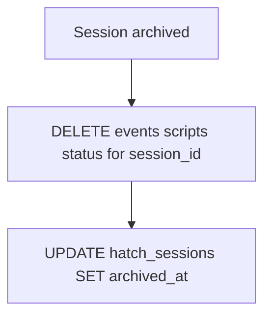

# Event retention (#145)

## Design (locked)

Hatchery owns **lifecycle cleanup**; the operator owns **capacity**.

| Behavior | What |
|---|---|
| Always purge | When a hatch session is archived, delete its child rows (`hatch_events`, `hatch_vm_scripts`, `hatch_vm_status`). Keep the `hatch_sessions` row with `archived_at` set. Archived = unseen = irrelevant without the environment. |
| No row-count warn | A threshold on `hatch_events` alone is not a real capacity signal — the DB has other tables. |
| No auto-trim | No age TTL, no global FIFO. Incomplete active transcripts are worse than a large DB. |

Self-trimming in normal use: dismiss/auto-archive sessions (and cull paths that lead to archive) reclaim event storage. Active transcripts stay complete until then.

## Scope vs original issue text

#145 asked for Settings retention configs and scheduled cleanup. After design discussion:

- **In scope:** purge-on-archive (the cleanup that matches product semantics)
- **Out of scope for this issue:** Settings knobs; row-count alerts; auto-trim
- **Future (separate issue if wanted):** warn on **total SQLite DB file size** (realistic capacity signal) — not a single-table row count

Update the GitHub issue body/acceptance criteria in the PR description so reviewers see the narrowed intent.

## Implementation

### 1. Purge on archive — [`lib/hatch.py`](lib/hatch.py)

Helper `_purge_session_children(conn, session_id)` deleting:

- `hatch_events` WHERE `session_id=?`
- `hatch_vm_scripts` WHERE `session_id=?`
- `hatch_vm_status` WHERE `session_id=?`

Call it from `archive_session` and the archive path inside `archive_if_terminal`, in the same transaction as setting `archived_at`.

### 2. Docs + tests

- [`.hatchery/docs/schema/database.md`](.hatchery/docs/schema/database.md) — Maintenance: document archive purge of session children (alerts keep existing `trim_alerts`)
- [`.hatchery/docs/events.md`](.hatchery/docs/events.md) — retention: complete while session active; purged on archive

Tests in [`tests/test_hatch.py`](tests/test_hatch.py):

- Archive deletes events/scripts/status for that session only
- Sibling sessions untouched
- Existing archive tests updated if they assume leftover child rows

No Settings / config / background-sync changes.

## Branch / issue

- Branch: `feat/145-event-retention`
- Label: `feat`
- Commit form: `feat: purge hatch session data on archive (#145)`
