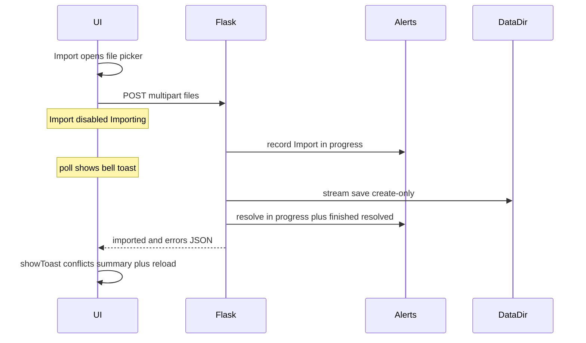

# Import buttons for inventory panes (#192)

## Feedback: Alerts + toasts (decision)

**Ship Import with both channels now — do not wait on #178, and do not defer observability to a follow-up.**

| Channel | Role |
|---------|------|
| **Alerts** ([`lib/alerts.py`](lib/alerts.py)) | Durable observability for slow copies (network drives, large ISOs). In-progress stays **active** (bell/tray) while the Nest is writing; finish **resolves** it and records a completed trail entry. Survives tab focus; other panes see the same state via alert polling. |
| **`hatchery.showToast`** | Immediate UI feedback for refuse-overwrite conflicts and a short success/partial summary when the `fetch` returns. [#178](https://github.com/dustinestes/Hatchery/issues/178) only improves toast visibility later. |

This matches the existing alert lifecycle in [`.hatchery/docs/notifications.md`](.hatchery/docs/notifications.md): active while a condition holds, system-resolved when it clears. “Import in progress” is that condition; completion must **not** leave an active alert that inflates the bell forever.

### Alert message contract (batch-scoped)

One active alert per import request (not per file), so multi-select does not spam the tray:

1. **After** request validation / before streaming writes:  
   `record_alert("Import in progress: N file(s) into <subdir>/")`  
   (skip duplicate via `has_active_alert` if needed; use a stable prefix for resolve).
2. **When the handler finishes** (success, partial, or all-rejected after the in-progress row was created):  
   `resolve_alerts_by_prefix("Import in progress: ")` for this batch’s message (or resolve by stored id).  
   Then record a **finished** alert and mark it resolved immediately (small helper or `record_alert` + `resolve(id)`) so it appears in Alerts history / can toast via poll without staying active, e.g.  
   `Import finished: N imported, M skipped into media/iso/ — ready to use`  
   or `Import finished with errors: …` when nothing imported.
3. If the request fails before any write (empty upload, etc.), do not leave a dangling in-progress alert.

Alert polling already runs on an interval while the page’s upload `fetch` is in flight, so the in-progress toast/bell can appear mid-copy without a progress bar.

Docs note: import uses Alerts for long-running operator copies (same active→resolved pattern as requirements/clutches), distinct from hatch **Events**.

## Approach

Browser `<input type="file" multiple>` → `POST` multipart → Nest writes into the correct data-dir subdirectory → refresh list. Manual filesystem placement remains valid; empty-state copy mentions both routes.

## Server

Add a small shared helper (prefer new [`lib/import_files.py`](lib/import_files.py) over growing [`hatchery.py`](hatchery.py)):

- Resolve dest root under `config.data_dir()` for a known kind only (`clutches`, `media/iso`, `media/virtio`, `automation/scripts`).
- For each uploaded file: safe basename only; reject empty/`..`; require allowed suffixes; if `dest.exists()` → **refuse** (no overwrite); else stream `file.save` / write create-only.
- Return JSON: `{ "imported": [...], "errors": [{ "name", "reason" }] }` (per-file so one conflict does not abort the whole batch).
- Wire the alert start / resolve / finished trail around the batch as above.

Routes (one family, four kinds), e.g.:

- `POST /api/import/clutches`
- `POST /api/import/media/iso`
- `POST /api/import/media/virtio`
- `POST /api/import/automation/scripts`

Allowed extensions:

- Clutches: `.yaml`
- Media ISO / VirtIO: `.iso`
- Scripts: keys of `_SCRIPT_LANGUAGES` in [`hatchery.py`](hatchery.py) (`.ps1`, `.sh`, …)

No `MAX_CONTENT_LENGTH` clamp in v1 (Flask default is unlimited); document that reverse proxies may need a higher body limit for large ISOs. v1 UX: disable Import while upload is in flight (“Importing…”) — no byte-progress bar; Alerts cover the wait.

Reuse safe-path patterns from [`lib/media_inspect.resolve_media_path`](lib/media_inspect.py) / `_resolve_script_path`.

## UI

- **Clutches** ([`templates/ui/clutches.html`](templates/ui/clutches.html)): secondary **Import** beside `+ New Clutch` in `.section-header`; update empty-state to mention Import.
- **Media** ([`templates/ui/media_inventory.html`](templates/ui/media_inventory.html)): Clutches-style header row above `.media-layout` with **Import**; pass import URL from `media_iso` / `media_virtio`; update empty nav copy.
- **Scripts** ([`templates/ui/automation_scripts.html`](templates/ui/automation_scripts.html)): same header + Import pattern; update empty copy.

Shared client pattern: hidden `input[type=file][multiple]` + labeled button → `FormData` fetch → toast conflicts / summary from JSON → full page reload on any successful import (simplest refresh for all three panes). Rely on existing alert polling for in-progress/finished Alerts UX; do not duplicate “started” as a second client-only toast unless the first poll is slow (optional: one local “Import started…” info toast when fetch begins).

A11y: visible “Import” label (not icon-only); keyboard-activatable; keep focus ring styles from existing `.btn`.

## Tests & docs

- Pytest: temp data dir; happy path; conflict leaves file unchanged; bad extension; basename sanitization; **in-progress alert recorded then resolved**; finished trail present and not left active.
- Docs: getting-started / media / automations — UI Import + manual place; short note under notifications that import uses the alert lifecycle for long copies.
- Link #192 in commit; branch `feat/192-import-assets`.

## Explicitly out of scope

- Nest-local path import
- Overwrite / rename-on-conflict
- Progress bars, remote URL fetch, in-app editors
- Media VHD/QEMU or `automation/os_config` panes
- #178 toast restyle (separate issue next)
- Async job queue / background import workers (single request still streams the body)

## Workflow when executing

- Confirm stop of Clockify #191 → start #192 (`feat` task).
- Branch from updated `main`; implement; `uv run ruff` + `pytest` before PR.
