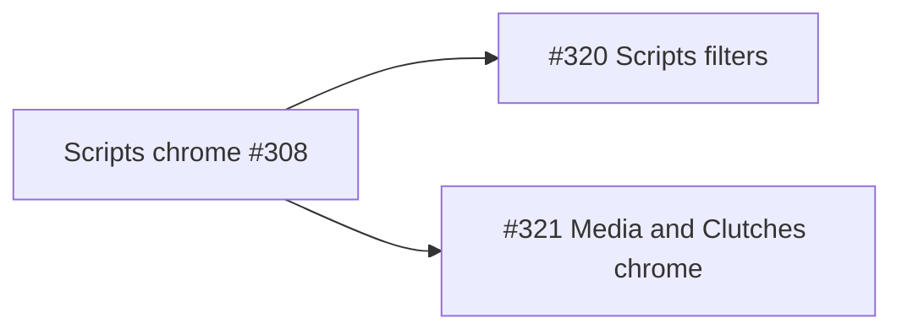

# Inventory follow-ons (#320 then #321)

**Sequence (locked):** [#320](https://github.com/dustinestes/Hatchery/issues/320) → merge → [#321](https://github.com/dustinestes/Hatchery/issues/321). Separate PRs; do not combine filters with chrome parity.

---

## PR 1 — #320 Scripts Cached filters

**Branch:** `feat/320-scripts-cached-filters`

**Scope:** Client-side filter bar on Automations → Scripts → Cached only. Library tab unchanged.

### UI

In [`templates/ui/automation_scripts.html`](templates/ui/automation_scripts.html), above `#scripts-nav` inside the Cached panel:

- `notif-filters` / `notif-filter-field` (same grammar as [`templates/ui/alerts.html`](templates/ui/alerts.html))
- Controls (labeled, keyboardable):
  - **Search** text input — match script name (case-insensitive substring)
  - **Language** select — All + distinct languages from rail `data-language`
  - **Library state** select — All / Local / In sync / Out of sync / Orphaned / Tip unknown (`drift_state` + orphan; map `unknown` if present on attrs)
- Dual empty states: existing empty nav vs filtered-empty stub (`role="status"`) when rail has items but none match
- Filtering hides non-matching `.scripts-nav-item` (do not destroy DOM); if active selection is filtered out, clear detail or select first visible

### JS

- `currentFilters()` → `applyScriptFilters()` on input/change
- After `refreshDriftInventory` / `applyDriftChrome`, re-apply filters so live drift updates keep the filter view correct
- No new API

### Tests / docs

- Assert filter markup + `aria-label` on Scripts page test in [`tests/test_app.py`](tests/test_app.py)
- Short note in [`docs/library.md`](docs/library.md) or Scripts-adjacent docs only if there is an existing Scripts inventory section; otherwise skip docs fluff

---

## PR 2 — #321 Media + Clutches chrome parity

**Branch:** `feat/321-inventory-chrome-parity`  
Remove `planning` label when implementation starts.

**Reference:** Scripts Cached after #308 ([`templates/ui/automation_scripts.html`](templates/ui/automation_scripts.html)).

### Shared chrome (both panes)

| Affordance | Behavior |
|---|---|
| Rail warn glyph | Non-button; show for `out_of_sync` or orphan; subtitle text too (not color alone) |
| Header Library control | Icon Sync (`--action`) / orphan warn → reattach modal; in sync / tip unknown disabled |
| Copy | Media: Path only (binary). Clutches: Path + Contents (YAML text) |
| Live refresh | `hatchery.onStatusTick` → enriched inventory GET → update rail attrs + header |
| Reattach | Same modal pattern / `library_cache_reattach` API as Scripts |

**CSS:** Extend existing Scripts chrome selectors to shared aliases (e.g. `.scripts-nav-drift-icon, .inventory-nav-drift-icon`) in [`static/style.css`](static/style.css) rather than a third parallel `media-*` status system. Markup uses `inventory-nav-drift-icon` / reuse `scripts-library-status-btn` + `scripts-copy-*` where practical.

### Backend — enriched list APIs

Mirror [`_scan_script_inventory`](hatchery.py) + `_enrich_library_inventory`:

- `GET /api/media/iso` and `GET /api/media/virtio` — return enriched item objects (name, paths, size, modified, `drift_state`, orphan, provenance), not bare name strings. Update any callers that expect string lists (grep `api/media/iso` in tests + [`static/app.js`](static/app.js)).
- `GET /api/clutches` — return enriched clutch inventory objects (same enrichment fields + name). Update callers expecting name strings.

Keep SSR enrichment on page render for first paint.

### Media ([`templates/ui/media_inventory.html`](templates/ui/media_inventory.html))

- Add rail drift icon + orphan/`data-lib-*` attrs
- Replace text Sync button with Scripts-style library status icon control + reattach modal
- Wire `onStatusTick` + enriched media GET for the current target (iso/virtio)
- Keep Path copy as icon control (no Contents)

### Clutches ([`templates/ui/clutches.html`](templates/ui/clutches.html))

Replace flat `.file-list` with Scripts/Media layout grammar:

- Left rail: clutch names + drift subtitle + warn glyph
- Detail header: Library status icon, **Edit** (existing edit route), **Hatch** (existing hatch route), Copy Path/Contents, Delete
- Detail body: path / modified / drift meta (no full YAML editor in-pane — Edit stays the editor)
- Contents copy: fetch existing clutch YAML API if present (`GET /api/clutch/<filename>` or equivalent); if only file path is available, read via a small content endpoint parallel to scripts
- Preserve Import dropdown, New Clutch, Library browser tab
- `onStatusTick` via enriched `GET /api/clutches`

### Docs / ADR

- Note shared inventory chrome in [`docs/library.md`](docs/library.md) (operator-facing)
- No new ADR unless we invent a new plugin boundary (we will not)

### Tests

- Page HTML asserts for Media/Clutches chrome markers
- API tests: enriched JSON shape + drift fields when Library enabled (monkeypatched)
- Regression: string-list consumers updated

---

## Out of scope (both PRs)

- Drift/evaluate/sync backend rules from #308
- Scripts filters on Media/Clutches (can follow later)
- Renaming all `scripts-*` CSS globally
