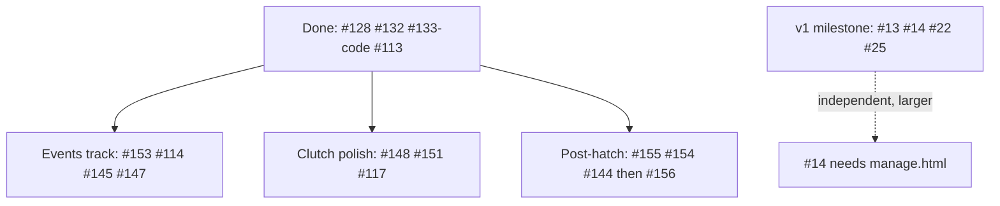

# Issue triage: logical next steps

## Backlog snapshot

35 open issues: **28 feat**, 2 fix, 2 refactor, 2 chore, 1 docs. Only **5** are milestoned (4 on v1, 1 on v2). Most recent closed work (#112–#142) built the hatch orchestration and `hatch_events` / `Write-HatchEvent` pipeline — that is the natural gravity well for what to do next.

## Housekeeping first

**[#133](https://github.com/dustinestes/Hatchery/issues/133)** is **implemented and tested** (`read_setup_log`, import in `_sync_hatch_status`, `test_imports_setup_log_events_before_fledging`) but the issue is still open. Close it against the landing PR/commit before starting new work.

## Recommended track: Events visibility (builds on last 2 weeks)

Backend + API for lifecycle events are done; Nests still shows a static “running” badge and Last Output from raw stdout. This is the highest ROI cluster.

| Priority | Issue | Size | Why now |
|---|---|---|---|
| 1 | [#153](https://github.com/dustinestes/Hatchery/issues/153) Last Output from `Write-HatchEvent` | S | Tiny fix; uses existing `hatch_events`; improves Nests immediately |
| 2 | [#114](https://github.com/dustinestes/Hatchery/issues/114) Events panel live feed UI | M | Data + `GET .../events` ready; only Nests UI/polling missing |
| 3 | [#145](https://github.com/dustinestes/Hatchery/issues/145) Event retention settings | M | Needed once the feed is used; follow existing `trim_*` patterns |
| 4 | [#147](https://github.com/dustinestes/Hatchery/issues/147) Alerts-only notifications | M | Makes sense after #114 so activity has a home outside the bell |

**Defer within this track:** [#129](https://github.com/dustinestes/Hatchery/issues/129) (live intra-script streaming) — larger WinRM Protocol change; not required for #114/#153.

## Strong alternate: Post-hatch cleanup / handoff

If you want product-hardening over UI:

| Order | Issue | Size | Notes |
|---|---|---|---|
| 1 | [#155](https://github.com/dustinestes/Hatchery/issues/155) RDP + AppX example scripts | S | Independent; supports “post-fledge access is user’s job” |
| 2 | [#154](https://github.com/dustinestes/Hatchery/issues/154) Disable autologon in cleanup | S | Small script/step; order matters vs provisioning |
| 3 | [#144](https://github.com/dustinestes/Hatchery/issues/144) Detach floppy/ISOs post-hatch | M | Provider detach + post-fledge hook |
| later | [#156](https://github.com/dustinestes/Hatchery/issues/156) Ephemeral `hatchery.admin` | L | Credential redesign; **supersedes [#149](https://github.com/dustinestes/Hatchery/issues/149)** — do not ship #149 first |

## Good small polish (anytime / between tracks)

- **[#148](https://github.com/dustinestes/Hatchery/issues/148)** ValidateLength — natural follow-on to #113 (S–M)
- **[#151](https://github.com/dustinestes/Hatchery/issues/151)** Missing script + storage path alerts — extends `_sync_clutches` after #92 storage_path (M)
- **[#117](https://github.com/dustinestes/Hatchery/issues/117)** Remove dead OS Config field — cleanup refactor (S–M)
- **[#120](https://github.com/dustinestes/Hatchery/issues/120)** Cull deletes disk — unblocked by storage_path (#92 landed)

## Park / do not start yet

| Issue | Reason |
|---|---|
| [#14](https://github.com/dustinestes/Hatchery/issues/14) Freeze/Thaw/Chirp (v1) | Provider snapshot methods exist; **manage.html is empty** — L, separate surface |
| [#13](https://github.com/dustinestes/Hatchery/issues/13) Automation pane (v1) | New pane; valuable but not blocked by recent work |
| [#22](https://github.com/dustinestes/Hatchery/issues/22) / [#25](https://github.com/dustinestes/Hatchery/issues/25) CLI / desktop launcher | Packaging; orthogonal to hatch quality |
| [#110](https://github.com/dustinestes/Hatchery/issues/110) / [#23](https://github.com/dustinestes/Hatchery/issues/23) | Explicit v2 |
| [#141](https://github.com/dustinestes/Hatchery/issues/141) Win11 black-screen hang | Guest/KVM investigation; hard to unit-test; intermittent |
| [#149](https://github.com/dustinestes/Hatchery/issues/149) Password show/hide | Likely obsolete under #156 |

## Default recommendation

Close **#133**, then ship **#153 → #114** as the next PR pair (or one PR if you want them together). That finishes the story the last several merges started: structured events that operators can actually see.
