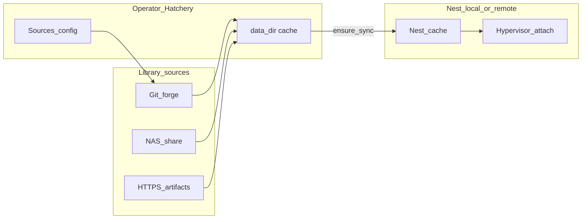

# Library, Nest cache, and content planes

## Decisions locked

- **Settings owns source config**; each asset pane keeps an in-context control.
- **Import UX:** when Library is disabled, keep a single **Import** (file → local cache). When Library is enabled, that control becomes a **dropdown / split**: **From file…** | **From library…** (no second permanent button).
- **Identity:** content id = **basename + checksum** (no GUID catalog).
- **Settings profiles:** same portable YAML/JSON for personal multi-host and light enterprise; live store remains SQLite `app_settings` ([#227](https://github.com/dustinestes/Hatchery/issues/227)).
- **Cache model:** every Nest (local or remote) has a **media/script/clutch cache**. Default hatch contract: **validate Nest cache has required content before hatch**; sync/ensure fills gaps. Later opt-in: **allow remote content** (Nest attaches/runs from a remote source without pre-download)—not v1.

## Content planes

- **Operator cache** = today’s data dir (`media/`, `automation/`, `clutches/`).
- **Nest cache** = same layout on the Nest host (for local Nest, operator data dir *is* the Nest cache).
- **Library** = configured sources; pull into operator cache; ensure into Nest cache as needed.
- Hypervisor attach always resolves to Nest-reachable paths unless the future **allow remote content** flag is on.

## GitHub / docs work (this plan’s delivery)

### 1. Promote [#198](https://github.com/dustinestes/Hatchery/issues/198) to parent epic

Rewrite body to the model above. Put on milestone **Cross-platform & remote Nests** (content + remote Nest hatch are coupled). Keep label `feat`.

### 2. File children (one concern each)

| Child | Scope |
|---|---|
| **Feature-gated Library nav** | `library_enabled` in `app_settings`; Settings → General toggle; when on, Settings gains **Sources** child (same sidebar pattern as [#146](https://github.com/dustinestes/Hatchery/issues/146)); deep link when off redirects with enable hint |
| **Sources + scripts pull** | First Library slice: configure sources; browse; pull into `automation/scripts/`; Automations Import → dropdown when Library on |
| **Media pull + Nest cache ensure** | Pull into operator `media/`; Nest ensure/sync by basename+checksum; hatch preflight “missing on Nest” |
| **Clutches pull** | Same source model into `clutches/`; Clutches Import dropdown when Library on |
| **Settings profile export/import** | Portable profile file ↔ `app_settings` (+ source defs / feature flags); no live git watch yet—path/git sync called out as follow-up |
| **Clarify [#215](https://github.com/dustinestes/Hatchery/issues/215)** | Comment + body tweak: hatch assumes Nest-local cache; transfer/ensure policy is Library/Nest-cache work, not attach-over-WAN from operator |

Defer as explicit non-goals on the epic: CMS, live remote ISO URLs in Clutches, allow-remote-content attach, continuous settings git watch.

### 3. Design doc

Add [`.hatchery/docs/library.md`](.hatchery/docs/library.md) (template header/footer, no “Related” laundry list):

- Planes: Library sources → operator cache → Nest cache → attach
- Identity: basename + checksum
- Import control: file vs library dropdown when enabled
- Hatch preflight validation
- Future: allow remote content
- Pointers to Nest transport / settings storage docs

Link from [`.hatchery/docs/README.md`](.hatchery/docs/README.md) and a short note on [#215](https://github.com/dustinestes/Hatchery/issues/215) / [`.hatchery/docs/providers.md`](.hatchery/docs/providers.md) media row if needed.

### 4. Out of scope for this pass

No Library pull implementation, no Nest sync code, no Import dropdown code—**issues + doc only**, so Phase 0 / Nest factory work can continue without a mega-PR.

## Implementation order (after this plan ships)

1. Feature gate + empty Sources stub (UI shell)  
2. Scripts sources + pull + Import dropdown  
3. Settings profile export/import  
4. Media pull + Nest ensure (unblocks meaningful remote hatch in #215)  
5. Clutches pull  
6. Later: allow remote content; profile path/git watch  

## Defaults chosen (no open options)

- Import becomes dropdown **only when** `library_enabled`  
- Checksum algorithm: **SHA-256** (document in `library.md`)  
- Local Nest: skip network ensure; preflight is filesystem check under data dir  
- Profile format: YAML under a stable schema version key (`version: 1`)
