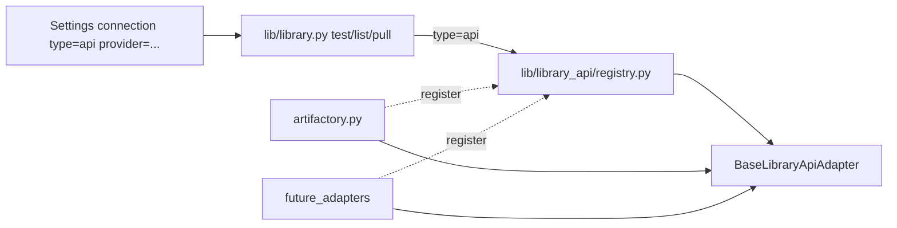

# Library API connection type + adapter plugins (#255)

## Goal

Treat **API catalogs** as one connection type with a **provider discriminator**, not an Artifactory-only feature. Artifactory is the first plugin (employer relevance + easy OSS Docker for manual tests). Adding Nexus/Harbor/etc. later should be “new module + register,” without editing path/HTTPS/git or other adapters.

## Architecture (locked)

Mirror the Nest provider shape lightly — not a framework:




| Layer                                  | Owns                                                                                                      | Must not own                                                |
| -------------------------------------- | --------------------------------------------------------------------------------------------------------- | ----------------------------------------------------------- |
| `[lib/library.py](lib/library.py)`     | Connection types `path` / `https` / `git` / `**api**`; shared catalog hit shape; dispatch `api` → adapter | Vendor URLs, AQL, Artifactory paths                         |
| `[lib/library_api/](lib/library_api/)` | Adapter ABC + registry + builtins registration                                                            | Domain bindings / Settings form layout beyond provider list |
| Each adapter module                    | Auth, ping, list/filter parsing, download + checksum mapping for **that** product                         | Other adapters’ imports or shared globals                   |


**Connection record** (extends today’s dict):

- `type: "api"`
- `provider: "artifactory"` (required when type is api; validated against registry)
- Existing: `id`, `label`, `base_uri`, `token`, `expires_at`, `kinds`

**Shared catalog hit** (unchanged contract for #244 / #250):

`{ name, relative_path, sha256 | null, connection_id, source_type: "api" }`

**Adapter interface** (`BaseLibraryApiAdapter`):

- `id` / `title` / `description` (Settings dropdown)
- `test(conn) -> {ok, message}`
- `list_hits(conn, filt, *, extensions, limit) -> list[hit]`
- `pull_file(conn, relative_path, dest: Path) -> {name, sha256, dest}` (create-only caller stays in `library._pull_file`)

**Registry**: `register(adapter)`, `get(provider_id)`, `all_providers()` — import-time registration from `register_builtins()` (same idea as validators). Unknown `provider` → clear `ValueError` at parse/test time.

**Filter semantics**: owned by the adapter, documented per provider. Artifactory v1: `repoKey/optional/path/glob` (first path segment = repo; rest = glob under that repo). Other adapters may define different filter grammar without changing the ABC.

## Artifactory adapter (first plugin)

Module: `[lib/library_api/artifactory.py](lib/library_api/artifactory.py)`

- **Base URI**: Artifactory root (e.g. `https://host/artifactory`)
- **Auth**: Bearer token when set (also accept empty for anonymous OSS setups)
- **Test**: `GET …/api/system/ping` (or version) — actionable ok/error
- **List**: Storage API folder walk and/or AQL bounded by filter + `extensions` + `limit`; map to Hatchery hits; prefer API checksum when present, else `null` (pull computes SHA-256)
- **Pull**: download artifact bytes to dest; prefer `X-Checksum-Sha256` / metadata when present, else hash the file

No Artifactory branding in the connection **type** label — Settings shows type **API** + provider **Artifactory**.

## Wiring (product surfaces)

- `[lib/library.py](lib/library.py)`: add `api` to `CONNECTION_TYPES`; `parse_connections` requires/validates `provider` for api; `test_connection` / `list_hits` / `_pull_file` dispatch via registry
- `[hatchery.py](hatchery.py)` Library Settings save: persist `library_conn_provider` alongside existing fields
- `[templates/ui/settings.html](templates/ui/settings.html)`: type option **API**; provider `<select>` visible when type=api (options from server-injected provider list); help text for filter grammar; `connPayload` includes `provider`
- Validator / health: unchanged prefixes — `test_connection` already covers api once wired (`[lib/library_health.py](lib/library_health.py)`)
- Docs: `[.hatchery/docs/library.md](.hatchery/docs/library.md)` — API type, adapter table, “how to add a provider” (new file + `register`), Artifactory filter/auth notes; touch [validators.md](.hatchery/docs/validators.md) only if needed
- **ADR (new in this PR)** — see belowd

## ADRs — bootstrap + this decision

Yes: an Architecture Decision Record is the right place for “why `api` + provider plugins, not type=artifactory.” Product docs (`library.md`) explain *how* to use it; the ADR explains *why* we chose this shape so future you (and contributors) do not re-litigate it into a vendor-specific fork.

The repo has **no ADR convention yet**. This PR bootstraps a **lightweight** one under project meta (same home as other architecture notes):


| Path                                                                                                 | Purpose                                                                                                                                                   |
| ---------------------------------------------------------------------------------------------------- | --------------------------------------------------------------------------------------------------------------------------------------------------------- |
| `[.hatchery/docs/adr/README.md](.hatchery/docs/adr/README.md)`                                       | When to write an ADR; numbering; status values (`Proposed` / `Accepted` / `Superseded`); link from `[.hatchery/docs/README.md](.hatchery/docs/README.md)` |
| `[.hatchery/docs/adr/0001-library-api-adapters.md](.hatchery/docs/adr/0001-library-api-adapters.md)` | First record: Library API connection type + pluggable providers                                                                                           |


**Template (Nygard-style, short):** Title, Status, Date, Context, Decision, Consequences. Optional: Alternatives considered. Link related issues (`#255`) and code (`lib/library_api/`).

**When to write more ADRs later (not this PR):** Nest plane / factory (#206/#207), status-surfaces gather→store→surface (#282), Controller-only install (#273) — backfill only if you hit the same decision again; do not boil the ocean.

**Keep ADRs lean:**

```
✅ Decisions that constrain future code (extensibility boundaries, “not X”)
✅ Accepted in the same PR that implements the decision

❌ Process essays or every bugfix
❌ Duplicating the how-to from library.md — ADR = why; library.md = operator/dev how
```

## Isolation rules (scale)

```
✅ New product = lib/library_api/<name>.py + register in register_builtins()
✅ Adapter-only tests mock urllib for that module
✅ Settings provider list = registry.all_providers() (no hard-coded vendor enum in HTML beyond template loop)

❌ Import artifactory helpers from a future nexus.py
❌ Put vendor JSON parsing in library.py
❌ Connection type named "artifactory" (that is the provider id)
```

## Tests

- Unit: registry register/get/unknown provider
- Artifactory: mocked HTTP for ping / list / pull (SHA from header + fallback hash)
- `parse_connections`: api requires provider; unknown provider fails; path/https/git unchanged
- Settings round-trip / app test only if form field wiring needs it

## Out of scope for this PR

- Additional vendors (Nexus, Harbor, …) — registry ready only
- Backfilling ADRs for older Nest/validator decisions (link from README as “candidates,” do not write them now)
- Richer browser (#244) / inventory overlay (#250)
- Encrypting tokens (#110)
- Changing path / https / git behavior

## Manual check (your OSS Artifactory Docker)

After implement: enable Library → type API / provider Artifactory → base URI + token → Test connection → binding filter `repo/**/*.iso` (or scripts) → list/pull into operator cache.