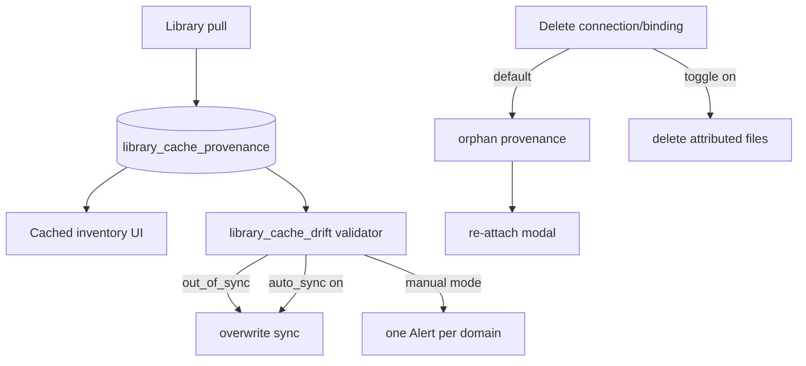

# Library cache provenance + drift sync (#308)

## Ship shape

- Branch: `feat/308-library-cache-drift`
- One PR closes **#308**; drop `planning` on open
- ADR-0012 in the same PR (provenance + drift locks; does not supersede ADR-0009/0010/0011)



## Locked product rules (from #308 + prior planning)

| Topic | Decision |
|---|---|
| Attribution | SQLite rows keyed by **`connection_id` / `binding_id`** (not labels) |
| Unique cache key | `(domain, media_target, cache_name)` — `media_target` empty string for scripts/clutches |
| Pre-Library files | No provenance row → **local** (no sync, no orphan) |
| Delete connection/binding | Default: leave files; provenance stays with stale ids → **orphan**. Optional confirm toggle **default off**: also delete attributed Cached files + provenance rows |
| Orphan UX | Warning control (icon + text); not syncable until re-attach |
| Re-attach | Modal: connection (+ binding if needed), optional `relative_path`, **Test**, rewrite provenance |
| Sync | Overwrite into same domain path; update `sha256_at_pull` + `source_digest` |
| Drift compare | **Never download an artifact body solely to hash it**. Each connection **type** has **one** tip-identity story for all domains (see below) |
| Alerts | Manual mode only; **one Alert per domain** with count; auto-sync on → resolve/never open drift Alerts |
| Create-only pull | Unchanged for first pull; sync is a separate overwrite path |

### Drift identity — one story per connection type

Hatchery **content identity** for Nest planes remains **SHA-256 of cached bytes** (`sha256_at_pull`). Drift vs Library **source tip** uses **`source_digest` + `source_digest_kind`** captured at pull and re-queried cheaply.

**Rule:** within a connection `type`, Scripts / Clutches / Media share the **same** tip check. Path is rudimentary → rudimentary findings; forges/APIs get richer metadata checks. **No mixed strategies within a type** (explicit non-goal in ADR-0012). Operator-facing [`docs/library.md`](docs/library.md) documents how each type validates so users know what “out of sync” means.

| Source type | One tip-identity story (all domains) | Kind |
|---|---|---|
| **path** | **`size` + `mtime`** of the source file on the path/share — no content hash for drift | `size_mtime` |
| **api** | Catalog/metadata **SHA-256** when present (e.g. Artifactory `actual_sha2`); if missing → `unknown` (no download) | `sha256` |
| **forge** | Forge-native **git blob SHA** from Trees/Contents (not Hatchery SHA-256 — ADR-0010); tree list only, no raw download | `git_blob` |
| **git** | **Blob id** from checkout tree / `ls-tree` after tip refresh — do not content-hash the blob for drift | `git_blob` |
| **https** | Checksum header on HEAD if present; else `unknown` — **do not GET** the body for drift | `sha256` or none → unknown |

**Why path is size+mtime only:** no checksum API; hashing would read every file (including ISOs) every tick; splitting “hash scripts / mtime media” is two mental models. If size or mtime changed on the share → out of sync; sync re-pulls bytes into cache.

If the cheap query fails (unreachable / truncated tree / no metadata) → `unknown` (not Alert-counted). **Sync** (manual or auto) is the only path that downloads/overwrites into the operator cache.

## 1. ADR-0012

Add [`docs/adr/0012-library-cache-provenance-drift.md`](docs/adr/0012-library-cache-provenance-drift.md) + index in [`docs/adr/README.md`](docs/adr/README.md):

- Provenance table, orphan/re-attach, cascade-delete default off
- Validator + auto-sync Alert policy
- **One tip-identity story per connection type** (path = size+mtime for all domains; api / forge / git / https as in table) — non-goal: mixed strategies within a type
- No body-download-for-hash; forge blob ≠ Hatchery SHA-256
- Consume-only still holds (ADR-0011 — sync updates local cache only, no forge push)

## 2. Schema + `lib/library_provenance.py`

Extend [`lib/db.py`](lib/db.py) `_SCHEMA` + document in [`docs/schema/database.md`](docs/schema/database.md):

```sql
library_cache_provenance (
  id INTEGER PK,
  domain TEXT NOT NULL,           -- scripts | clutches | media
  media_target TEXT NOT NULL DEFAULT '',  -- iso | virtio | ''
  cache_name TEXT NOT NULL,      -- basename in operator cache
  connection_id TEXT NOT NULL,
  binding_id TEXT,               -- nullable
  relative_path TEXT NOT NULL,
  source_type TEXT NOT NULL,
  sha256_at_pull TEXT NOT NULL,   -- Hatchery content identity of cached bytes
  source_digest TEXT,            -- tip identity for drift (API sha256, git/forge blob, or size:mtime)
  source_digest_kind TEXT,       -- sha256 | git_blob | size_mtime
  last_source_digest TEXT,       -- last successful remote/source compare
  drift_state TEXT NOT NULL DEFAULT 'unknown',  -- in_sync | out_of_sync | unknown | orphan
  checked_at TEXT,
  pulled_at TEXT NOT NULL,
  updated_at TEXT NOT NULL,
  UNIQUE(domain, media_target, cache_name)
)
```

Module API (thin, tested): `upsert_on_pull`, `get_for_cache`, `list_for_domain`, `mark_orphan_for_connection` / `mark_orphan_for_binding`, `delete_rows_and_files` (cascade), `reattach`, `set_drift_state`, `delete_row`.

Adapters gain a cheap **`source_digest(conn, relative_path) -> (kind, digest)`** (or list-hit fields) used by the validator — **no** full-file download.

## 3. Wire pull + sync overwrite

[`lib/library.py`](lib/library.py):

- After successful `_pull_file` / public `pull_*`, call `upsert_on_pull` (pass optional `binding_id`; capture **`source_digest` + kind** per type — path always size+mtime for every domain; Artifactory sha; GitHub/git blob SHA; HTTPS header when present)
- Add `sync_*` (or `_pull_file(..., overwrite=True)`) that replaces existing dest; updates `sha256_at_pull`, `source_digest`, `drift_state=in_sync`
- Pull APIs in [`hatchery.py`](hatchery.py): accept optional `binding_id`; new `POST …/sync` for Scripts / Clutches / Media

UI Library pull already has connection + path — pass `binding_id` when the catalog row has it ([`static/app.js`](static/app.js)).

## 4. Connection / binding delete lifecycle

[`api_library_connection_delete`](hatchery.py) / binding delete:

- Body flag `delete_attributed_cache` (default **false**)
- False → leave files; leave provenance rows (orphan computed when connection/binding missing)
- True → delete attributed operator-cache files + provenance rows (parallel to existing git clone-cache checkbox)

Settings modals in [`templates/ui/settings.html`](templates/ui/settings.html): new checkbox (default unchecked) on connection remove **and** binding remove; keep git clone-cache checkbox separate for `type=git`.

## 5. Cached inventory UX

Enrich scanners (`_scan_script_inventory`, clutch/media list helpers) with provenance + `drift_state` / orphan flag.

Per domain Cached UI ([`templates/ui/automation_scripts.html`](templates/ui/automation_scripts.html), clutches, media):

- **Sync** control: enabled + accent when `out_of_sync`; dimmed/disabled when `in_sync` / `local` / `orphan` / `unknown` (accessible name states why)
- **Orphan warning** control → opens re-attach modal (Escape/focus trap consistent with existing Settings modals)
- Not color-only ([#161](https://github.com/dustinestes/Hatchery/issues/161) / a11y rule)

Re-attach API: list connections/bindings for domain; `POST` test path + commit rewrite.

## 6. Validator `library_cache_drift`

New class in [`lib/validators/builtins.py`](lib/validators/builtins.py) (`scope=content`, default interval ~300s):

1. For each provenance row whose connection/binding still exists: call cheap **`source_digest`** for that type; compare to stored `source_digest`; set `drift_state` (`in_sync` / `out_of_sync` / `unknown`)
2. Missing connection/binding → `orphan` (no Alert)
3. If `auto_sync`: overwrite sync out-of-sync rows (this **is** allowed to download); **do not** open drift Alerts (resolve any existing)
4. Else: count out_of_sync per domain → at most one Alert each, message like `Library cache drift: Scripts — N out of sync with Library`; resolve when count is 0

**Hard rule:** validator compare path must not download artifact bodies (forge/API) or content-hash path files for drift — path uses size+mtime only. Tests assert forge/API mocks use metadata/tree endpoints only; path compare uses `stat` only.

Extend [`lib/validators/settings.py`](lib/validators/settings.py) + Settings Validators UI: optional `auto_sync` bool for this validator only (`supports_auto_sync` on the class), shown next to its interval.

Alert prefix registered next to Library prefixes in [`lib/alerts.py`](lib/alerts.py) if nest-scoped cleanup needs it (domain Alerts are Controller-scoped).

## 7. Docs + tests

- [`docs/library.md`](docs/library.md): provenance, sync, orphan/re-attach, cascade-delete, link ADR-0012
- **Operator-facing “How drift is detected”** (dedicated subsection and/or a row in each Path / Git / Forge / API / HTTPS section): one clear story per type so users know what out-of-sync means without reading the ADR
- [`docs/validators.md`](docs/validators.md): register `library_cache_drift`
- Tests (mocked sources, tmp `data_dir` + db):
  - pull writes provenance (`sha256_at_pull` + `source_digest`); create-only still 409
  - sync overwrites + updates both digests
  - delete connection without cascade → orphan; with cascade → files gone
  - re-attach rewrites ids
  - validator: out_of_sync Alert once per domain; auto_sync skips Alerts
  - forge drift uses Trees blob SHA (mock must **not** hit raw download URL)
  - API drift uses AQL/metadata SHA (mock must **not** hit artifact download URL)
  - path drift uses size+mtime for scripts **and** media (same story; no content hash)
  - no `library/git/` side effects for forge

## Out of scope (unchanged)

- Nest-cache ensure (#215), allow-remote-content (#252)
- Background git clone refresh
- Clutch↔forge round-trip (ADR-0011)
- Backfilling provenance for files pulled before this ships
