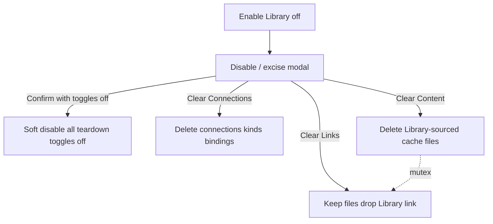

# #379 Library disable / excise (planning)

## Scope of this issue

[#379](https://github.com/dustinestes/Hatchery/issues/379) acceptance is **planning only**: ADR + docs outline + child issues. Implementation is follow-on.

Issue body sketched a dual Clear connections / Clear bindings pair; **this plan revises that**: bindings-only (or connections-without-bindings) is a half-removal state with no operator value on a full Library disable. Promote the revised contract into **ADR-0019** (`Accepted` in the planning PR) and wire docs/index. Comment the revision on #379 when the ADR lands.

## Locked decisions (ADR content)

**Vocabulary** (issue comment): **Enabled** / **Disabled** for `library_enabled`; **Remove / clear / forget** for teardown depth - never “connected” for this story.

**Soft disable** (flag off, all modal toggles off):

- Hide Library nav / Connections / From library… (already largely true today)
- Library validators no-op; resolve Library Alerts (already on off-transition in [`hatchery.py`](hatchery.py) ~1099)
- Domain caches stay hatchable; Library **link** rows **kept** (re-enable can restore linked UX)
- Sync/drift chrome suppressed while disabled; small “was linked from Library” cue (implementation child)

**Modal toggles** (defaults **off**), on Settings → General when turning Enable Library **off** - three depths; labels are operator language (not internal “registry / attributed” jargon):

| Toggle (UI) | Helper / subtext | Effect |
|---|---|---|
| **Clear Connections** | Includes all bindings for those connections | Delete all connections, kinds, and bindings. (If classic `type: git` still exists, also delete `{data_dir}/library/git/` clones; prefer C first.) Does **not** delete domain cache files by itself |
| **Clear Content** | Deletes Cached files that came from Library | Delete operator-cache files that are Library-linked; wipe those link rows. Never deletes local-only (unlinked) files |
| **Clear Links** | Leaves files in place as local inventory (no Library link) | Drop Library link / linked indicators; **keep** the files. Operator-facing term matches linked cues - not internal “provenance” |

**Clear Content vs Clear Links:** alternate treatments of the same linked set:

- Clear Content → files **gone**, links for those files gone  
- Clear Links → files **stay**, links gone (local forever; no sync chrome)

**Both on is invalid.** UI: selecting one turns the other **off** (mutex). Clear Connections stays independent of either.

**Git clone cache (not dual inventory):** `{data_dir}/library/git/` is the Controller **shallow-clone** cache for classic **`type: git`** connections only ([ADR-0009](docs/adr/0009-library-git-checkout-cache.md)). Forge connections never write there ([ADR-0010](docs/adr/0010-library-forge-providers.md)). Operator bytes stay in `automation/scripts/`, `clutches/`, `media/…`. ADR-0019 names this so “library/” on disk is not read as attributed inventory. While `type: git` still ships, Clear Library registry deletes those clones (parity with per-connection remove).

**Rejected (vs original #379 draft):** separate Clear connections vs Clear bindings on this modal. Surgical per-connection / per-binding remove while Library is still **Enabled** stays on Connections.

**Abandoned:** dual `data-dir/library/{domain}` inventory root (ADR-0016; ADR-0019 cites).

**Non-goals for #379:** Clutch invalidation alerts on disable/clear; full Cleaners (#361); rich WHERE provenance UI.

## Sequence (revised)

Classic **`type: git`** + `{data_dir}/library/git/` is **overdue removal**, not a nice-to-have after disable/excise. Forge ([ADR-0010](docs/adr/0010-library-forge-providers.md)) already covers the HTTPS forge case without a Controller working tree; `type: git` should have left when forge shipped.

**Preferred order:**

1. **Pre-work C** - Remove classic `type: git` (planning ADR or breaking ADR superseding ADR-0009; migrate/docs; delete clone-cache code). Path + forge remain.
2. **#379 planning** - ADR-0019 disable/excise (three toggles). If C is already merged, Clear Library registry has **no** `library/git/` clause - only connections/kinds/bindings.
3. **#379 children A/B** - modal + soft-disable chrome.

If C cannot land first, ADR-0019 still documents clone cleanup as a **transitional** note until C merges - do not expand git support.

## Related issue C (file immediately; prefer before A/B)

**C - Remove classic `type: git` Library connections** (`feat` or `breaking` + planning as needed):

- Drop `type: git` from Connections UI/API; forge + path only
- Supersede [ADR-0009](docs/adr/0009-library-git-checkout-cache.md); delete `{data_dir}/library/git/` code in [`lib/library.py`](lib/library.py)
- Migrate guidance: existing git connections → forge (GitHub) or path
- Not blocked on GitLab/Bitbucket/Gitea (#310–#312); GitHub forge + path is enough to retire clone-based git

## Deliverables (this PR = #379 planning only)

1. **[`docs/adr/0019-library-disable-excise.md`](docs/adr/0019-library-disable-excise.md)** - Decision = Clear Connections / Clear Content / Clear Links + content↔links mutex; ADR may say provenance in Decision/implementation notes but UI copy must say **linked / Clear Links**
2. **[`docs/adr/README.md`](docs/adr/README.md)** - index row for 0019
3. **[`docs/adr/0016-library-operator-plane.md`](docs/adr/0016-library-operator-plane.md)** - Related note → ADR-0019
4. **[`docs/library.md`](docs/library.md)** - operator how-to outline for disable/excise
5. **Issues to file:**
   - **C first** (remove `type: git` / supersede ADR-0009) - treat as pre-work queue ahead of A/B
   - **A** - disable/excise modal + APIs (after C preferred)
   - **B** - soft-disable Cached chrome
   - Clear Links (drop Library link, keep files) inside A; mutex with Clear Content

Drop `planning` from #379 when the ADR PR merges.

## Out of scope for #379 PR

- Modal JS / purge APIs / soft-disable chrome code
- Changing Settings YAML import to run excise (import keeps flag+registry as today)

## Suggested branch / commit

`docs/379-library-disable-excise-adr` · `docs: ADR-0019 Library disable / excise (#379)`
