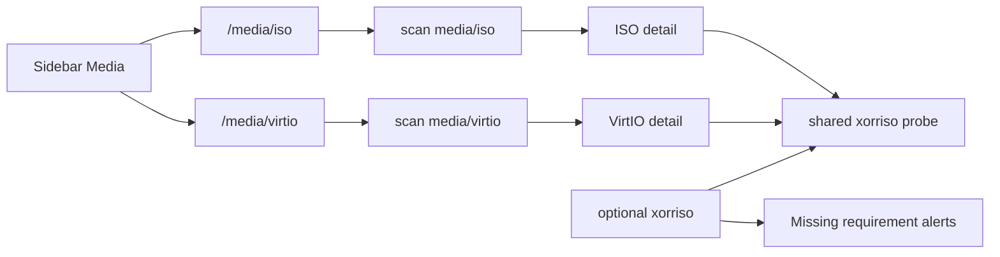

# Media pane (#70) — epic; ISO + VirtIO first

## Decisions

- **Nav:** Media sidebar **group** with typed subnodes (not one filtered table).
- **This PR:** **ISO and VirtIO** — both are live Hatchery hatch inputs (`os_media`, `virtio_drivers`).
- **Later:** VHD and QEMU children (different metadata shapes / not required for current hatch path).
- **Metadata tools:** Host CLIs used for Media probes must be Nest **requirements** (alerts + install docs). This PR: **`xorriso` only**. No **7zip** dependency. WIM/UDF image indexes → [#189](https://github.com/dustinestes/Hatchery/issues/189).

## Issue topology

[#70](https://github.com/dustinestes/Hatchery/issues/70) is the **epic**. Children:

| Child | Scope | When |
|---|---|---|
| [#186](https://github.com/dustinestes/Hatchery/issues/186) | ISO + VirtIO panes, `xorriso` probe, Used-by, docs | **This PR** |
| [#187](https://github.com/dustinestes/Hatchery/issues/187) | VHD inventory | Later |
| [#188](https://github.com/dustinestes/Hatchery/issues/188) | QEMU inventory | Later |
| [#189](https://github.com/dustinestes/Hatchery/issues/189) | Investigate UDF/WIM indexes (no 7zip assumed) | Later |

Branch: `feat/186-media-iso-virtio-panes`.

## Nest requirements, alerts, docs

Extend [`lib/requirements.py`](lib/requirements.py) `_OPTIONAL_CLI_TOOLS`:

| CLI | Apt package | `required_for` |
|---|---|---|
| `xorriso` | `xorriso` | Media ISO/VirtIO volume label and boot metadata |

Existing `_sync_requirements` alerts cover optional tools. Docs: getting-started + README/CONTRIBUTING optional Media note (`sudo apt install xorriso`). Tests update requirement counts/optional flags.

UI when `xorriso` is missing: volume/boot show unavailable; pane still works (file list, size, mtime, Used-by, copy path).

## UX

**Sidebar** ([`templates/ui/base.html`](templates/ui/base.html)): Media group between Clutches and Automations; sublinks **ISO** and **VirtIO** only (VHD/QEMU when those issues ship).

**Layout:** Scripts/Events master-detail per subnode. No binary content viewer; structured metadata + copy path.

**Shared list row:** filename + subtitle (volume label when known, else size).

**Detail — common (both panes):** path, size, modified, volume ID, boot summary (via `xorriso` when present), copy absolute path.

**Detail — ISO-only extras:**

- **Used by** from Clutch `os_media`
- WIM/image indexes **not** in this PR ([#189](https://github.com/dustinestes/Hatchery/issues/189))

**Detail — VirtIO-only extras:**

- **Used by** from Clutch `virtio_drivers`

Empty states point at `media/iso/` or `media/virtio/`.

## Backend

In [`hatchery.py`](hatchery.py) (or a small `lib/media_inspect.py` if helpers get large):

- Shared scan inventory: name, paths, size, mtime
- Shared `_iso_probe(path)` via `xorriso` (timeout; never fail the page) — volume_id, boot_record, media_summary
- Lazy inspect API on select (avoid probing every file at SSR): `GET /api/media/iso/<name>/inspect` and VirtIO equivalent
- `_media_used_by(field)` — `os_media` vs `virtio_drivers`
- `GET /media` → redirect to `/media/iso`; SSR panes for ISO and VirtIO
- Keep existing form-refresh string list APIs

## Frontend

- [`templates/ui/media_iso.html`](templates/ui/media_iso.html), [`templates/ui/media_virtio.html`](templates/ui/media_virtio.html) — shared structure; introduce `.media-*` classes from Scripts patterns
- Copy-path + toast; keyboard list nav; accessible names on icon buttons

## Tests (panes)

- Redirect `/media`; both panes 200; sidebar group + active child
- Temp-dir fixtures with placeholder files; empty-state paths
- Probe failures / missing CLIs do not 500

## Explicitly not in this PR

- VHD / QEMU panes (#187 / #188)
- WIM/UDF image indexes or any **7zip** dependency (#189)
- Hard-required Nest packages for hatch (`xorriso` stays **optional**)
- Upload / delete / file-manager reveal
- Merging Media into Automations
