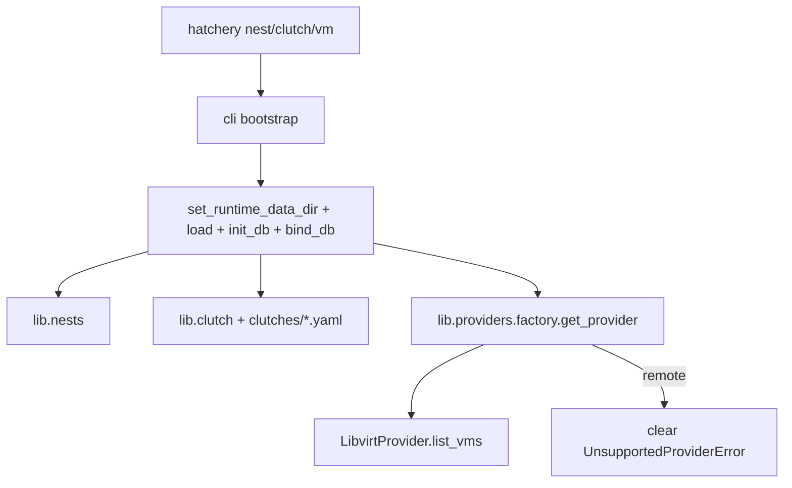

# Operator CLI inspect slice (#23)

## Scope for this PR

| Ship now | Defer (follow-on under #23 / new child) |
|---|---|
| `hatchery nest list` | `vm start\|stop\|cull\|snapshot\|revert\|health` |
| `hatchery nest test <id>` | `hatchery hatch ...` |
| `hatchery clutch list` | |
| `hatchery clutch show <file>` | |
| `hatchery vm list [--nest <id>]` | |

Matches ADR-0013 and the issue’s “inspect before mutating” guidance. Mutating power is thin on `BaseProvider`, but hatch needs orchestration extracted from [`hatchery.py`](hatchery.py); keep that out of this PR.

**Issue hygiene:** PR body uses `Part of #23` (not `Closes`). After merge, either leave #23 open with a mutate checklist or file a Phase 4b child and narrow #23.

## Architecture

**Do not** `import hatchery` from operator commands (that starts Flask, validators, background threads). Mirror boot from [`hatchery.py`](hatchery.py) lines 444–447 only via a shared helper.

### Where data comes from (locked for this slice)

| Command | Source |
|---|---|
| `nest list` | Controller SQLite Nest registry only |
| `clutch list\|show` | Controller `data_dir` Clutch files |
| `nest test` | Live Nest check (local tools or remote transport) |
| `vm list` | Live Nest hypervisor via factory (`virsh` for local libvirt). Remote → unsupported until providers/#345 |

**SQLite for remote async / last-known Nest inventory:** yes, that direction is right for [#345](https://github.com/dustinestes/Hatchery/issues/345) (job envelope, event catch-up, Controller reconciliation) and fits ADR-0004 gather → store → poll. Controllers already persist Nest registry, hatch sessions, and thin status snapshots. Do **not** invent a remote VM inventory cache or job tables inside this CLI PR. Local `vm list` stays live (same as UI); cached Nest inventory is a Nest-plane follow-on that CLI and UI should both read once it exists.

## Implementation

### 1. Shared bootstrap + Nest resolve

Add [`lib/cli/bootstrap.py`](lib/cli/bootstrap.py) (name flexible):

- `apply_data_dir(path)` → `config.set_runtime_data_dir` when set
- `init_controller_runtime()` → `config.load()`, `init_data_dir()`, `db.init_db(...)`, `config.bind_db()`
- `resolve_nest_id(explicit: str | None) -> str` → explicit or `nests.default_nest_id()`; else exit with empty/ambiguous Nest message (ADR-0014)

Register `--data-dir` on each operator command group (same session semantics as serve; not Settings).

### 2. Command modules

Wire in [`lib/cli/__init__.py`](lib/cli/__init__.py) beside serve:

| Module | Commands | Backend |
|---|---|---|
| [`lib/cli/nest.py`](lib/cli/nest.py) | `list`, `test <id>` | `list_nests()`, `get_nest` + `test_connection` |
| [`lib/cli/clutch.py`](lib/cli/clutch.py) | `list`, `show <file>` | glob `data_dir/clutches/*.yaml`; `clutch.load` for show |
| [`lib/cli/vm.py`](lib/cli/vm.py) | `list [--nest]` | `get_provider` → `list_vms()` |

Output: plain text tables/lines suitable for terminals (stable enough for tests; no JSON flag in v1).

Exit codes: `0` ok; `1` operational failure (test failed, unknown Nest, unsupported remote); `2` argparse usage.

### 3. Docs

Update planned pages to **Shipped (inspect)** and document deferrals:

- [`docs/cli/nest.md`](docs/cli/nest.md), [`clutch.md`](docs/cli/clutch.md), [`vm.md`](docs/cli/vm.md), [`docs/cli/README.md`](docs/cli/README.md)

### 4. Tests

Extend [`tests/test_cli.py`](tests/test_cli.py) with isolated `--data-dir`:

- Empty registry: `nest list` empty; `vm list` clear error
- Seed Local via `ensure_local_nest`: `nest list` shows `local`; `nest test local` (mock `test_connection` / requirements as needed)
- Clutch list/show with a fixture YAML under sandbox `clutches/`
- `vm list` with mocked `get_provider` / `list_vms`
- Remote Nest → user-facing unsupported message (not traceback)

## Out of scope

- `settings` (#344)
- Nest async agent, job tables, remote VM inventory cache (#345 / epic #202)
- Extracting `_run_hatch_session` from Flask
- Pause/resume (not on `BaseProvider`)

## Branch / Clockify

- Branch: `feat/23-operator-cli-inspect`
- Timer: issue_start on #23 when leaving Plan to implement
