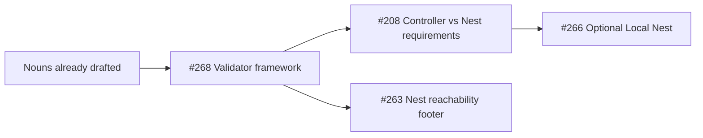
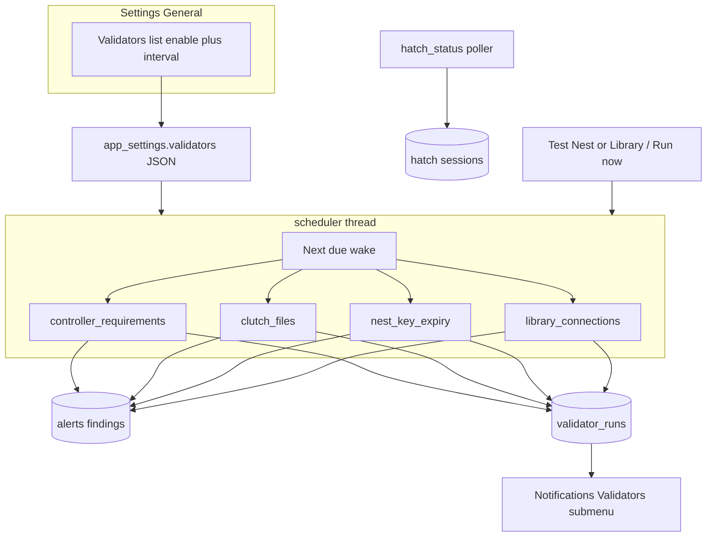

# Pluggable validators (#268) — then #208 connects

## Sequencing (locked)

1. **Housekeeping (before coding #268)** — reshape #208 / WIP so context is preserved without painting into a corner; update [#265](https://github.com/dustinestes/Hatchery/issues/265); Clockify switch 208→268.
2. **Implement [#268](https://github.com/dustinestes/Hatchery/issues/268)** — shared contract + scheduler + Settings + migrate existing syncs onto it.
3. **Later [#208](https://github.com/dustinestes/Hatchery/issues/208)** — Controller UI-only checks + Nest capability checks as validators / `run_now` hooks (no new catch-all).
4. **Later [#263](https://github.com/dustinestes/Hatchery/issues/263)** — Nest reachability validator + footer UX.
5. **Later Library connection health** — implement `library_connections` validator body (reachability / auth / stale / token expiry); ties to [#254](https://github.com/dustinestes/Hatchery/issues/254).

---

## Phase 0 — Reshape #208 and pause (do first)

**GitHub**

- Edit [#208](https://github.com/dustinestes/Hatchery/issues/208): explicit **Blocked by / depends on #268**; Related links `#268` by number; state that Nest/Controller check *bodies* land in #208 but must **register as validators**, not extend `_background_loop`.
- Edit [#265](https://github.com/dustinestes/Hatchery/issues/265): add a feature highlight for **architecture observability** — Controller / Nest / Library connection availability and requirements (validators, Alerts, Nest health) as a compelling orchestration capability alongside Library / events / rerun.

**Working tree on `feat/208-portable-host-requirements`**

- **Keep:** architecture nouns in [`.cursor/rules/hatchery-core.mdc`](.cursor/rules/hatchery-core.mdc), [`.cursor/rules/cross-platform.mdc`](.cursor/rules/cross-platform.mdc), [`.hatchery/docs/architecture-nests.md`](.hatchery/docs/architecture-nests.md) (Controller / Local Nest / Remote Nest).
- **Restore from `main`:** [`lib/requirements.py`](lib/requirements.py), [`hatchery.py`](hatchery.py) sync/alert prefix changes, [`lib/providers/base.py`](lib/providers/base.py) / [`libvirt.py`](lib/providers/libvirt.py) premature `LOCAL_NEST_TOOLS` wiring if it only served the abandoned fit, [`tests/test_requirements.py`](tests/test_requirements.py), [`tests/test_app.py`](tests/test_app.py) sync tests, seed/docs that describe the half-migrated alert wording ([`notifications.md`](.hatchery/docs/notifications.md), [`providers.md`](.hatchery/docs/providers.md), [`tests.md`](.hatchery/docs/tests.md), seed alerts) — re-apply only noun-safe doc lines after restore.
- **Branch strategy:** rename or cut a small `docs/…` / `chore/architecture-nouns` commit from the noun-only diff (or fold nouns into the #268 PR as a first commit). Do **not** ship the abandoned requirements rewrite. Park #208 until #268 merges.

---

## Phase 1 — Validator framework design (#268)

### Problem

[`_background_loop`](hatchery.py) runs a fixed bundle on one [`bg_interval`](lib/config.py) (default 60s): requirements, clutches, hatch status, Nest SSH expiry. That cannot express Controller-only vs Nest-over-SSH cadences or Settings enable/disable per concern.

### Contract (concrete)

New package [`lib/validators/`](lib/validators/):

| Piece | Role |
|---|---|
| `base.py` | `BaseValidator`: `id`, `title`, `description`, `scope` (`controller` \| `nest` \| `content`), `default_interval_seconds`, `default_enabled`, `run(ctx: ValidatorContext) -> None` |
| `context.py` | `ValidatorContext` — access to data dir, list nests, `record`/`resolve` alert helpers (wrap [`lib/alerts.py`](lib/alerts.py)), optional `nest_id` for on-demand runs |
| `registry.py` | Register builtins; `get(id)`, `all()` |
| `scheduler.py` | Single daemon thread: wake on next due time (cap tick ~5s); for each enabled validator, if due, call `run`; **persist** each run to `validator_runs` (not memory-only) |
| `runs.py` | CRUD for run history — list recent, latest-per-validator (Settings summary), insert on complete |
| `settings.py` | Read/write per-validator `{enabled, interval_seconds}` from SQLite `app_settings` key `validators` (JSON), merge with defaults |

### Two channels (do not conflate)

| Channel | Table / API | Meaning |
|---|---|---|
| **Alerts** | existing `alerts` | *Findings* — a condition that needs attention (missing tool, bad Clutch, unreachable Nest). Bell / tray / toasts. |
| **Validator runs** | new `validator_runs` | *Observability of the validators themselves* — each scheduled or on-demand execution: started/finished, ok vs error, short summary. |

In-memory-only `last_run` / `last_error` is **not** enough. Persist runs in SQLite so Notifications can show history across restarts and Controllers stay inspectable.

**Findings still → Alerts** (stable prefixes per validator). A successful run that finds nothing wrong inserts a run row with `status=ok` and does **not** spam the Alerts bell. A run that records/updates alerts still writes a run row (`status=ok` if the validator completed, even when it opened alerts — optional `findings_count`; `status=error` only if the validator itself crashed).

**On-demand API:** `run_validator(id, *, nest_id=None, trigger="schedule"|"manual"|"connection")` for Settings “Run now”, Nest/Library Test connection, and the scheduler.

**Not a validator:** `_sync_hatch_status` stays an orchestration poller in [`hatchery.py`](hatchery.py) (lifecycle, not health/requirements). Scheduler may still call it on a fixed interval owned by the app (document as “Hatch monitor”, not listed as a user-toggle validator in v1 — avoids operators disabling fledging by accident).

### Schema: `validator_runs` (align with alerts / events tokens)

Follow the same conventions as [`alerts`](.hatchery/docs/schema/database.md): ISO 8601 UTC text timestamps, small vocabulary fields, integer PK.

| Column | Type | Notes |
|---|---|---|
| `id` | `INTEGER` PK | Auto-assigned |
| `validator_id` | `TEXT` NOT NULL | Registry id (e.g. `clutch_files`) |
| `started_at` | `TEXT` NOT NULL | ISO 8601 UTC |
| `finished_at` | `TEXT` | ISO 8601 UTC when complete |
| `status` | `TEXT` NOT NULL | `ok` \| `error` (validator execution outcome) |
| `tier` | `TEXT` NOT NULL DEFAULT `info` | Same toast/alert vocabulary: `info` / `warning` / `alert` — UI badges align with Alerts pane |
| `trigger` | `TEXT` NOT NULL | `schedule` \| `manual` \| `connection` |
| `message` | `TEXT` NOT NULL | Short human summary (e.g. “3 Clutch alerts active” / “SSH failed: …”) |
| `detail` | `TEXT` | Optional longer error / traceback (truncated); keep out of list UI by default |
| `nest_id` | `TEXT` | Optional scope when Nest-specific |
| `findings_count` | `INTEGER` DEFAULT 0 | How many alert conditions this run touched/opened (optional signal) |

**Retention (Settings-configurable):** default **50 runs per `validator_id`** on insert. Operators can raise/lower this under Settings → General (Validators block or adjacent “Run history retention” control) — store as `validators_run_retention` (or under the `validators` JSON as `_meta.retention_per_validator`) in `app_settings`. Floor of **10**, sensible ceiling (e.g. **500**) to avoid unbounded DB growth. Export/import includes the retention value.

Managed by `lib/validators/runs.py`; schema in [`lib/db.py`](lib/db.py) + [schema/database.md](.hatchery/docs/schema/database.md).

### Notifications UI

Extend the existing Notifications sidebar group (today: Alerts + Events in [`templates/ui/base.html`](templates/ui/base.html)):

- **Notifications → Validators** — Events-style / Alerts-style pane: reverse-chronological run history; filters by validator id and status; show tier badge + timestamp + message (not color-only).
- Route e.g. `/notifications/validators`; `GET /api/validators/runs` for the pane (and Settings last-run chips).
- Does **not** drive the Alerts bell (run history is inspectable, not “unread alert” spam).

### Settings UX

- Under **Settings → General**: **Validators** block — title, description, enabled, interval (min 10s); **last status** from latest `validator_runs` row (text + tier), link to Notifications → Validators; plus **run history retention** (per-validator max rows, default 50).
- Migration: existing `bg_interval` seeds each validator’s interval once; then unused (fallback default only). Export/import YAML includes `validators` map and retention ([`lib/settings_io.py`](lib/settings_io.py)).
- A11y: visible labels, keyboardable controls, status not color-only.

### First migrations (same PR as framework)

| Validator id | Migrates from | Notes |
|---|---|---|
| `controller_requirements` | `_sync_requirements` | Keep **current** `lib.requirements.check_all()` behavior for now; #208 replaces the *body* and alert wording later |
| `clutch_files` | `_sync_clutches` | Unchanged semantics |
| `nest_key_expiry` | `_sync_nest_key_expiry` | Unchanged semantics |

Stub registrations (disabled by default or enabled no-op until follow-ups) — Settings shows the full intended set; follow-ups only implement `run()`:

| Validator id | Follow-up | Intent |
|---|---|---|
| `nest_reachability` | [#263](https://github.com/dustinestes/Hatchery/issues/263) | Nest transport “can reach”; footer Local + Remotes |
| `nest_capability` | [#208](https://github.com/dustinestes/Hatchery/issues/208) | Nest “can run as Nest” (hypervisor/libs; remote over tunnel) |
| `library_connections` | [#254](https://github.com/dustinestes/Hatchery/issues/254) + Library health | Scope `content`. Periodic / on-demand checks for registered Library connections: unreachable, auth failure, wrong/stale config, and token expiry (when set). Reuse existing Library “Test connection” logic where possible; alert with a stable prefix (e.g. `Library connection:`). Configurable enable + interval like other validators. |

Library fits the same observability story as Nest health: operators learn that an external artifact source went dark or credentials went stale before hatch/preflight fails mysteriously.

### Docs

- New [`.hatchery/docs/validators.md`](.hatchery/docs/validators.md): contract, Alerts vs validator runs, Settings, Notifications submenu, how to add a validator, builtin inventory.
- Update [`.hatchery/docs/notifications.md`](.hatchery/docs/notifications.md): Notifications umbrella includes **Validators** (run history) alongside Alerts / Events / (future Audit); Background sync → validators.
- Schema: [`.hatchery/docs/schema/database.md`](.hatchery/docs/schema/database.md) `validator_runs`.
- Index link in [`.hatchery/docs/README.md`](.hatchery/docs/README.md).
- Agent rule: new health checks register as validators (#268); persist runs; do not extend a private catch-all.

### Tests

- Unit: registry, settings merge, scheduler due/skip, `run_validator` writes `validator_runs`, retention trim.
- App: Settings GET/POST validators; Notifications Validators pane / API; `bg_interval` migration; conftest stops scheduler thread.
- Existing Clutch/requirements/key-expiry alert tests retargeted to validator `run`.

### Branch / PR

- Branch: `feat/268-pluggable-validators`
- PR closes #268; mentions #208/#263/#265 as follow-ons
- Clockify: stop #208, start #268 on implementation (after this plan is accepted)

---

## What #208 does after #268 (preview only)

- Implement `controller_requirements` check body: UI/runtime only (no `virsh`).
- Implement `nest_capability`: provider-declared tools; Local Nest on-box; Remote Nest over Nest transport after reachability.
- Wire Nest Settings “Test connection” = reachability + `run_validator("nest_capability", nest_id=…)`.
- No new background loop code in `hatchery.py`.

---

## Non-goals for #268 PR

- Full remote Nest hypervisor probes (`nest_capability` body)
- Footer Local + Remotes (#263)
- Full Library connection probe / token-expiry alerting body (`library_connections` is stub-registered only)
- Optional Local Nest registry (#266)
- Making hatch lifecycle a user-disableable validator
- Public REST for validators
