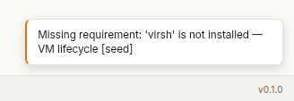
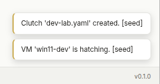
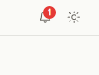
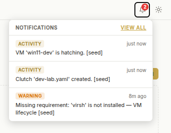
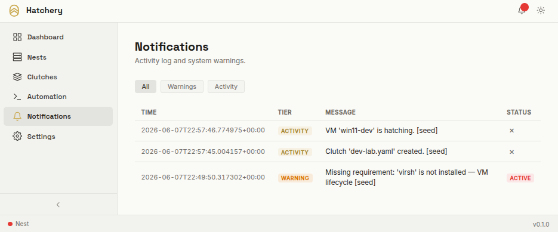

<br><br>
<picture>
  <source media="(prefers-color-scheme: dark)" srcset="../branding/icons/hatchery-icon-dark.svg">
  
</picture>
<h1>Notifications</h1>
<br clear="both">

How Hatchery surfaces system warnings and activity events — tiers, lifecycle, UI components, and startup sync.

<br>

## Contents

- [Contents](#contents)
- [Overview](#overview)
- [Tiers](#tiers)
- [UI Components](#ui-components)
  - [Toast Overlay](#toast-overlay)
  - [Bell Badge](#bell-badge)
  - [Tray Dropdown](#tray-dropdown)
  - [Notifications Pane](#notifications-pane)
- [Lifecycle](#lifecycle)
  - [Creation](#creation)
  - [Resolution](#resolution)
  - [Dismissal](#dismissal)
  - [Status matrix](#status-matrix)
- [Startup Sync](#startup-sync)
- [Contributor Tooling](#contributor-tooling)

---

<br>

## Overview

Hatchery uses a lightweight notification system to communicate two categories of events: system warnings (missing host requirements, degraded state) and activity events (VMs hatched, Clutch files exported). Both categories share the same storage, the same UI surfaces, and the same polling mechanism.

Notifications are stored in the `notifications` table in `hatchery.db` and served from `/api/notifications`. The browser polls this endpoint on every page load and updates all UI surfaces — toast overlay, bell badge, tray dropdown, and the Notifications pane — without requiring a page refresh.

<br>

---

## Tiers

| Tier | Meaning | Source | Resolution |
|---|---|---|---|
| `warning` | System is degraded — a required tool is missing or a host condition is unmet | Startup sync | Auto-resolved when the condition clears on next restart |
| `activity` | Something happened — a VM was hatched, a Clutch was exported | User action | Dismissible by the user |

**Warnings** are system-owned. They are recorded at startup, re-evaluated on every restart, and resolved automatically when the triggering condition is gone. Users cannot manually resolve a warning — they can only dismiss it from the UI (which hides it without marking it resolved).

**Activity** notifications are action-owned. Each user action that completes successfully (hatch, export, append) records an activity notification. These accumulate as a history and can be individually dismissed.

<br>

---

## UI Components

There are four surfaces that show notification state. All four derive from the same `/api/notifications` poll.

### Toast Overlay

A brief banner that appears in the bottom-right corner when new notifications arrive. Toasts auto-dismiss after 4 seconds. Warnings render with a distinct color; activity notifications render neutral.

<table><tr>
<td></td>
<td></td>
</tr></table>

Toasts only appear for notifications created since the last poll. The browser tracks the last poll time in `localStorage` (`hatchery-notif-last-read`) and compares it against each notification's `created_at` timestamp. A page load that finds no new notifications shows no toasts.

### Bell Badge

The bell icon in the top bar carries a red badge when there are unresolved warnings. The badge count shows unread notifications; the red color signals that at least one warning is active. When there are no warnings and no unread notifications, the badge is hidden.



### Tray Dropdown

Clicking the bell opens a compact tray showing the five most recent notifications. Each entry shows the tier badge, a relative timestamp ("just now", "3m ago"), and the message. A "View all" link navigates to the full Notifications pane.



### Notifications Pane

The full notification history, accessible from the sidebar or the tray "View all" link. Displays up to 500 notifications in reverse-chronological order.

Filter buttons narrow the view to a single tier (Warnings or Activity). Each row shows the time, tier badge, message, and status. Activity notifications in their default state show an inline dismiss button. Resolved and dismissed records show a status badge instead.



<br>

---

## Lifecycle

### Creation

Notifications are written by calling `lib.notifications.record(tier, message)`. This inserts a row into the `notifications` table with:

- `created_at` — UTC ISO 8601 timestamp
- `tier` — `"warning"` or `"activity"`
- `message` — human-readable description
- `resolved = 0`, `dismissed = 0`

After every insert, the table is trimmed to 500 rows (newest kept). See [`schema/database.md`](schema/database.md) for the full schema.

### Resolution

Resolution is a **system action**. A warning is marked `resolved = 1` when the condition that triggered it no longer exists — for example, a previously missing tool is now installed. This happens automatically at startup via the requirements sync (see [Startup Sync](#startup-sync)).

Resolved warnings remain in the table as historical records. They appear in the Notifications pane with a "Resolved" status badge and are excluded from the unresolved warning count used by the bell badge and footer indicator.

### Dismissal

Dismissal is a **user action**. A user can dismiss any active activity notification from the Notifications pane using the inline dismiss button. Dismissal marks `dismissed = 1` and replaces the button with a "Dismissed" badge.

Dismissed notifications remain in the table. A dismissed warning still counts as unresolved — dismissal is cosmetic, not a system state change. To clear a warning, the underlying condition must be resolved (the tool must be installed).

### Status matrix

| `resolved` | `dismissed` | Rendered as |
|---|---|---|
| 0 | 0 | Active warning badge or dismiss button (activity) |
| 0 | 1 | Dismissed badge |
| 1 | 0 | Resolved badge |
| 1 | 1 | Resolved badge (resolved takes precedence) |

<br>

---

## Startup Sync

Every time Hatchery starts, it calls `_sync_requirements()` before serving any requests. This function:

1. Resolves all existing unresolved warnings whose message starts with `"Missing requirement:"` — clearing any stale state from a previous run.
2. Checks which required host tools are currently missing via `lib.requirements.check_all()`.
3. Records a fresh `warning` notification for each missing tool.

The result: the warning state in the database always reflects the current host condition as of the last startup. If a tool was missing in a prior run and is now installed, the old warning is resolved and no new one is recorded. If a new tool is missing, a fresh warning appears.

Requirements are not re-checked on every request — only at startup. Restarting Hatchery after installing missing tools clears the warnings.

<br>

---

## Contributor Tooling

A seed script in `.hatchery/tooling/` inserts sample notifications for UI validation and screenshot capture. Seeded records are marked with `[seed]` so they can be identified and removed without touching real notification history.

**Seed one notification at a time:**

```bash
# Insert the next curated warning (cycles through samples with each call)
uv run python .hatchery/tooling/seed_notifications.py seed warning

# Insert the next curated activity notification
uv run python .hatchery/tooling/seed_notifications.py seed activity

# Insert a custom message of any tier
uv run python .hatchery/tooling/seed_notifications.py seed warning "Missing requirement: 'virsh' is not installed"
uv run python .hatchery/tooling/seed_notifications.py seed activity "VM 'win11-dev' is hatching."
```

Calling `seed warning` or `seed activity` multiple times cycles through the curated sample list, inserting one new record per invocation. This allows incremental insertion for capturing UI state at each step — e.g., insert one, screenshot the toast; insert another, screenshot the tray; repeat.

**Seed all curated samples at once:**

```bash
uv run python .hatchery/tooling/seed_notifications.py seed all
```

Inserts all curated warning and activity samples in one pass. Useful for capturing the Notifications pane with a populated list.

**Remove all seeded records:**

```bash
uv run python .hatchery/tooling/seed_notifications.py clean
```

Deletes every record containing the `[seed]` marker. Real notifications are unaffected.

The script requires Hatchery to have been started at least once (so `hatchery.db` exists). It reads the same data directory configuration as the app, so it seeds the same database the running app reads.

<br>

---

<picture>
  <source media="(prefers-color-scheme: dark)" srcset="../branding/logos/hatchery-logo-dark.svg">
  
</picture>
<div align="right">Where environments hatch</div>
<br clear="both">
