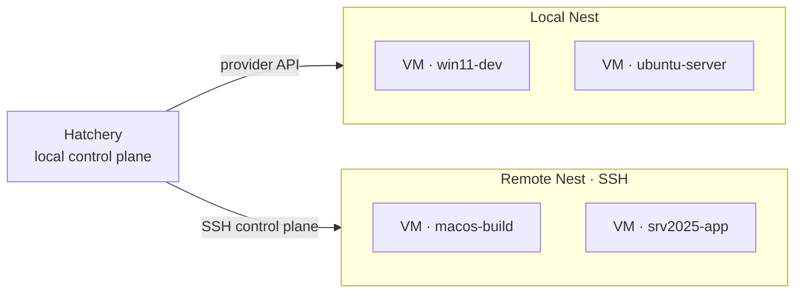

<br/><br/>

<div align="center">

<br/>

<picture>
  <source media="(prefers-color-scheme: dark)" srcset=".hatchery/branding/logos/hatchery-logo-dark.svg">
  
</picture>

<p><strong>Hatch. Provision. Scale.</strong></p>

<br/>


<br/>

</div>

<br/><br/>

---

Hatchery is a local web application for creating, provisioning, and managing VMs on local and remote Nests. Point it at source media, fill in a form, and get a fully provisioned VM without touching a terminal.

---

<br/>

## What It Does

- **Hatch** - create guest VMs from source media using unattended install methods on local and remote hosts
- **Provision** - runs defined script automations on the new guest to baseline the configuration
- **Scale** - operate one local Nest or many remote Nests from a single control plane
- **Library** - pull Clutches, scripts, and media from shares, forges, and API catalogs into a local-first cache
- **Manage** - start, stop, destroy, snapshot, and restore from a browser UI
- **Observe** - monitor Hatchery, Nests (local and remote), and individual VMs
- **Notify** - alerting, event tracking, and auditing across the fleet

---

<br/>

## Library connections

Connections are named endpoints (base URI + optional token); **bindings** attach a connection + filter results to Scripts, Clutches, or Media..

| Type | What it reaches | List / pull |
|---|---|---|
| **Path / share** | Local directory or mounted NAS | Recursive glob |
| **HTTPS** | Static HTTP(S) base | Explicit relative file path(s) in the binding filter |
| **Git** | Forge or local repo (shallow clone cache) | Path glob on the default branch |
| **API** | Catalog backends via **provider plugins** | Provider-specific filter (first: **Artifactory** - `repoKey[/path/glob]`) |

---

<br/>

## What It's Made Of

### Architecture



One Hatchery instance on your workstation drives a local Nest and any number of remote Nests over SSH. Hatch, provision, and lifecycle actions run against whichever Nest you choose. The same UI covers a local host and remote hosts across the network.

### Stack

| Piece | Role |
|---|---|
| **Python ≥3.11** + **uv** | Runtime and dependency management |
| **Flask** + **Gunicorn** | Local web app and API |
| **Jinja2** + vanilla **HTML/CSS/JS** | UI pages and unattended-install templates (no JS framework) |
| **SQLite** | App state: hatch sessions, events, alerts, settings |
| **YAML** + **Pydantic** | Clutch blueprints and validated config |
| **libvirt / KVM / QEMU** | Nest provider for Linux hosts: create, lifecycle, and snapshots |
| **OpenSSH** | Nest control plane to remote hosts |
| **Answer files** + **WinRM** | Unattended guest install, then scripted baseline provisioning |

<br>

> Layout and module map → [Project Structure](docs/project-structure.md)

---

<br/>

## What It Supports

| Guest OS | Provider | Status |
|---|---|---|
| Windows 10 | KVM/QEMU | v1 |
| Windows 11 | KVM/QEMU | v1 - requires UEFI + TPM |
| Windows Server 2022 | KVM/QEMU | v1 |
| Windows Server 2025 | KVM/QEMU | v1 - requires UEFI + TPM |
| Linux guests | KVM/QEMU | Planned |
| Windows (Hyper-V) | Remote Nest via SSH (WinRM Nest fallback planned) | Planned |

<br>

> Full Nest × feature matrix (libvirt / UTM / Hyper-V, local and remote) → [Provider support matrix](docs/providers.md)

---

<br/>

## Remote Nest SSH (quick start)

Hatchery talks to remote Nests as an **SSH client**. Keys stay on the Hatchery host; Nests trust Hatchery’s public key.

1. Create (or reuse) an OpenSSH key pair on the machine running Hatchery
2. Install the **public** key in the Nest’s `authorized_keys` (or equivalent)
3. Settings → **Nests** → add a remote Nest → set **Identity file** to the private key path (e.g. `~/.ssh/id_ed25519`)
4. Use **Test Nest connection**

Best effort today: Hatchery stores **paths only** (never private key bytes). WinRM Nest passwords are entered for tests only and not persisted. Deeper setup and troubleshooting → [#260](https://github.com/dustinestes/Hatchery/issues/260).

---

<br/>

## What It Requires

| Requirement | Notes |
|---|---|
| Ubuntu host | KVM-capable hardware |
| `qemu-kvm`, `libvirt`, `virtinst` | VM control stack |
| `swtpm`, `swtpm-tools` | TPM emulation (Win11 / Server 2025) |
| Python ≥3.11 | Runtime |
| Windows ISO(s) | Your own eval or licensed copies |
| VirtIO driver ISO | Optional - higher performance disk/network |

```bash
sudo apt install qemu-kvm libvirt-daemon-system virt-manager virtinst \
    libguestfs-tools swtpm swtpm-tools python3
```

---

<br/>

## Where To Start

1. **Install host dependencies** - see requirements above
2. **Clone and install Python deps** - `uv sync`
3. **Run Hatchery** - `uv run hatchery serve --host 127.0.0.1 --port 5000` (or `uv run gunicorn hatchery:app --bind 127.0.0.1:5000 --workers 1`)
   > To run as a background service that starts automatically, see [Running as a Service](docs/getting-started.md#running-as-a-service).
4. **Open the dashboard** - `http://localhost:5000`
5. **Hatch a VM** - go to `/create`, fill in the form, click Hatch

<br>

> Getting Started → [Getting Started Guide](docs/getting-started.md)

---

<br/>

## What's Planned Next

- **Planned and in-progress** → [GitHub Issues](https://github.com/dustin-estes/hatchery/issues)
- **Shipped by version** → [GitHub Releases](https://github.com/dustin-estes/hatchery/releases)

---

<br/>

## How to Contribute

Contributions, ideas, and feedback are welcome. See [CONTRIBUTING.md](CONTRIBUTING.md) for guidelines.

---

<br/>

## How It's Licensed

MIT License. See [LICENSE](LICENSE) for full terms.

---

<br/>

## With Thanks To

- **Dustin Estes** - creator, product design, and development

<br>

---

<picture>
  <source media="(prefers-color-scheme: dark)" srcset=".hatchery/branding/logos/hatchery-logo-dark.svg">
  
</picture>
<div align="right">Hatch. Provision. Scale.</div>
<br clear="both">
