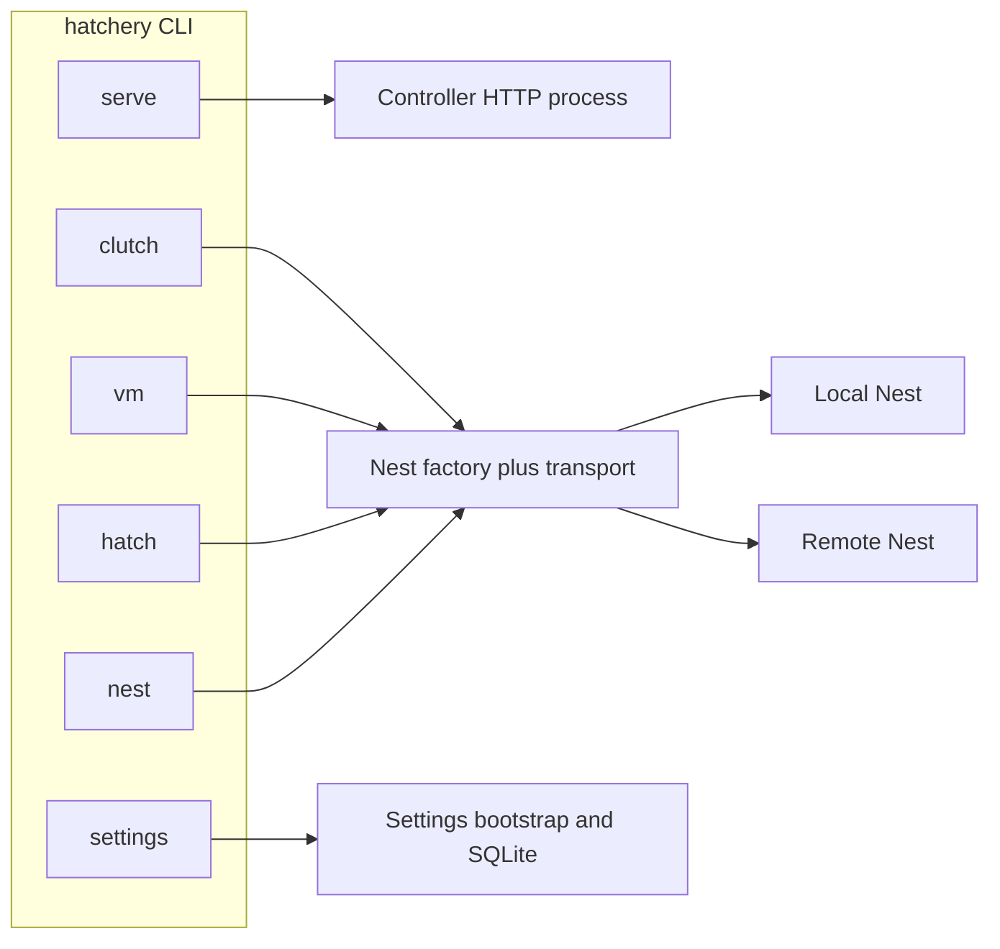

<br><br>
<picture>
  <source media="(prefers-color-scheme: dark)" srcset="../../.hatchery/branding/icons/hatchery-icon-dark.svg">
  
</picture>
<h1>CLI</h1>
<br clear="both">

Hatchery ships one console script, ``hatchery``, with subcommands for **launch** and **operator** work. Design: [ADR-0013](../adr/0013-hatchery-cli-launch-and-operator.md). Product north star (CI/CD and external tooling): [ADR-0021](../adr/0021-controller-embeddable-operator-plane.md). Epic: [#336](https://github.com/dustinestes/Hatchery/issues/336).

Code lives under [`lib/cli/`](../../lib/cli/). Docs here mirror that layout: each command module has a matching page.

<br>

## Contents

- [Contents](#contents)
- [Locked design](#locked-design)
- [How to run](#how-to-run)
- [Modules](#modules)

---

<br>

## Locked design



| Surface | Job | Session vs persist |
|---|---|---|
| **Launch** (`serve`) | Start the Controller | `--data-dir` / `--nest-local` / bind are session-only; never write Settings |
| **Operator** (`clutch`, `vm`, `hatch`, `nest`, `session`) | Nest-scoped inspect and lifecycle | In-process Nest factory; no running Controller required. Inspect is read-only: requires an existing data dir (does not mkdir / create DB). |
| **Settings** (`settings`) | Persist Settings from the terminal | Distinct from launch overrides ([#344](https://github.com/dustinestes/Hatchery/issues/344)) |

<br>

## How to run

After `uv sync` in a clone:

```bash
uv run hatchery serve --host 127.0.0.1 --port 5000
uv run hatchery serve --data-dir /path/to/sandbox --host 127.0.0.1 --port 5000
uv run hatchery serve --data-dir /path/to/sandbox-local --nest-local --host 127.0.0.1 --port 5000
uv run hatchery nest list
uv run hatchery --json nest list
uv run hatchery clutch list
uv run hatchery vm list --nest local
uv run hatchery vm start test26
uv run hatchery vm pause test26
uv run hatchery vm resume test26
uv run hatchery vm snap take test26 --label smoke
uv run hatchery hatch --clutch demo.yaml --password dc01=secret
uv run hatchery session list
uv run hatchery --help
uv run hatchery serve --help
```

<br>

## Machine-readable output (`--json`)

Global flag on the root parser: `hatchery --json <command> …` ([#423](https://github.com/dustinestes/Hatchery/issues/423)). Default remains human tables / text. Exit codes are unchanged. Mutate verbs (`vm start`, `hatch`, `session retry`, …) stay text-only in this pass.

| Command | JSON shape (field names) |
|---|---|
| `nest list` | Array of `{id, name, provider_type, location, host}` |
| `nest test` | `{ok, message, nest_id}` |
| `clutch list` | `{clutches: [filename, …]}` |
| `clutch show` | `{name, description, file, vms: [{name, os, vcpus, ram_gb}, …]}` |
| `vm list` | `{nest, vms: [{name, status}, …]}` |
| `vm health` | `{nest, name, ip, winrm, reachable}` |
| `vm snap list` | `{nest, name, snapshots: [label, …]}` |
| `session list` | Array of `{id, nest, status, clutch_file, clutch_name, hatched_at}` |
| `session show` | `{id, nest, clutch_file, clutch_name, status, hatched_at, archived_at, vms: [{vm_name, status, error, events}, …]}` |

Schema may evolve; treat field names as the contract for automation, not pretty-print layout.

Equivalent contributor paths:

```bash
# Same app object; session data dir via env
HATCHERY_DATA_DIR=/path/to/sandbox uv run gunicorn hatchery:app --bind 127.0.0.1:5000 --workers 1

# Module form
uv run python -m lib.cli serve --host 127.0.0.1 --port 5000
```

Open `http://127.0.0.1:5000` (or your bind). Full host setup: [getting-started.md](../getting-started.md). Contributor notes and Run and Debug configs: [CONTRIBUTING.md](../../CONTRIBUTING.md).

<br>

## Modules

| Doc | Code | Status | Description |
|---|---|---|---|
| [serve.md](serve.md) | [`lib/cli/serve.py`](../../lib/cli/serve.py) | **Shipped** (#22, #266 `--nest-local`) | Start the Controller HTTP server |
| [clutch.md](clutch.md) | [`lib/cli/clutch.py`](../../lib/cli/clutch.py) | **Shipped (inspect)** (#23) | List/show Clutch files |
| [vm.md](vm.md) | [`lib/cli/vm.py`](../../lib/cli/vm.py) | **Shipped** (#23 inspect, #353 mutate) | Nest-scoped VM list + lifecycle |
| [hatch.md](hatch.md) | [`lib/cli/hatch.py`](../../lib/cli/hatch.py) | **Shipped** (#353) | Hatch a Clutch onto a Nest |
| [session.md](session.md) | [`lib/cli/session.py`](../../lib/cli/session.py) | **Shipped** (#421 list/show, #422 retry) | Hatch sessions inspect + retry |
| [nest.md](nest.md) | [`lib/cli/nest.py`](../../lib/cli/nest.py) | **Shipped (inspect)** (#23) | List Nests / Test Nest connection |
| [settings.md](settings.md) | `lib/cli/settings.py` | Planned (#344) | Persist Settings (`get` / `set`) |
| (index `--json`) | [`lib/cli/output.py`](../../lib/cli/output.py) | **Shipped** (#423) | Global `--json` on inspect/list/show |

Operator inspect (`nest`, `clutch`, `vm list`) shipped under [#23](https://github.com/dustinestes/Hatchery/issues/23). Mutating `hatch` and VM lifecycle ship under [#353](https://github.com/dustinestes/Hatchery/issues/353). Session inspect ships under [#421](https://github.com/dustinestes/Hatchery/issues/421). Machine-readable `--json` ships under [#423](https://github.com/dustinestes/Hatchery/issues/423).


<br>

---

<picture>
  <source media="(prefers-color-scheme: dark)" srcset="../../.hatchery/branding/logos/hatchery-logo-dark.svg">
  
</picture>
<div align="right">Hatch. Provision. Scale.</div>
<br clear="both">
