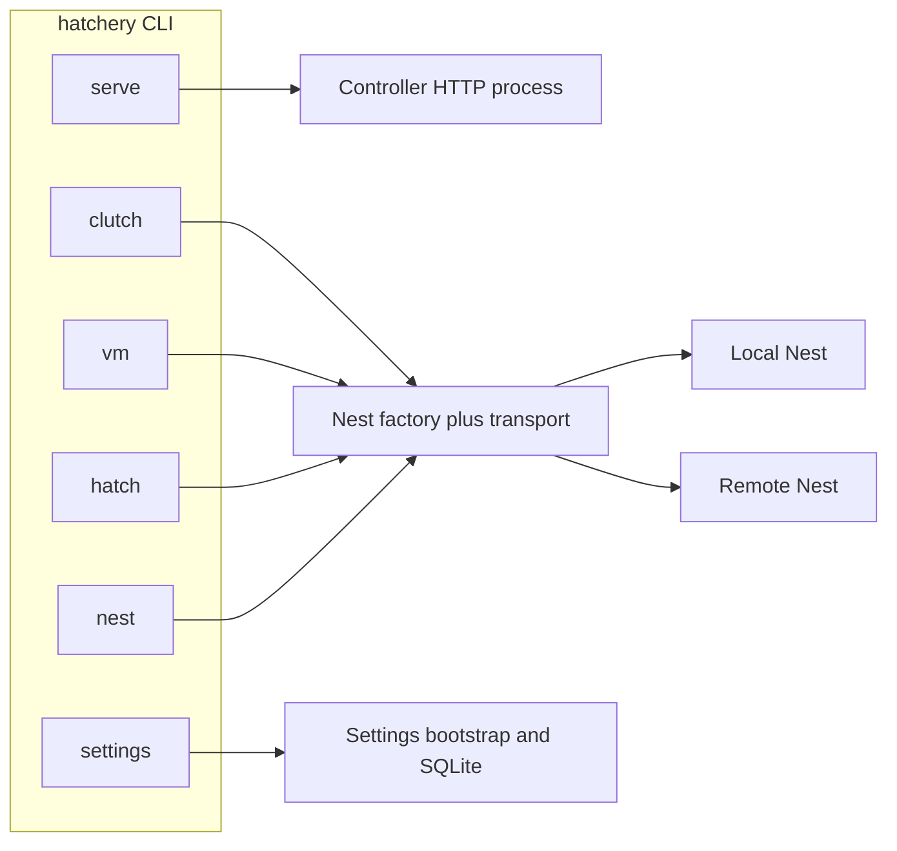

<br><br>
<picture>
  <source media="(prefers-color-scheme: dark)" srcset="../../.hatchery/branding/icons/hatchery-icon-dark.svg">
  
</picture>
<h1>CLI</h1>
<br clear="both">

Hatchery ships one console script, ``hatchery``, with subcommands for **launch** and (later) **operator** work. Design: [ADR-0013](../adr/0013-hatchery-cli-launch-and-operator.md). Epic: [#336](https://github.com/dustinestes/Hatchery/issues/336).

Code lives under [`lib/cli/`](../../lib/cli/). Docs here mirror that layout: each command module has a matching page.

<br>

## Contents

- [Contents](#contents)
- [Locked design](#locked-design)
- [How to run](#how-to-run)
- [Modules](#modules)

---

<br>

## Locked design



| Surface | Job | Session vs persist |
|---|---|---|
| **Launch** (`serve`) | Start the Controller | `--data-dir` / bind are session-only; never write Settings |
| **Operator** (`clutch`, `vm`, `hatch`, `nest`) | Nest-scoped inspect and lifecycle | In-process Nest factory; no running Controller required |
| **Settings** (`settings`) | Persist Settings from the terminal | Distinct from launch overrides ([#344](https://github.com/dustinestes/Hatchery/issues/344)) |

<br>

## How to run

After `uv sync` in a clone:

```bash
uv run hatchery serve --host 127.0.0.1 --port 5000
uv run hatchery serve --data-dir /path/to/sandbox --host 127.0.0.1 --port 5000
uv run hatchery --help
uv run hatchery serve --help
```

Equivalent contributor paths:

```bash
# Same app object; session data dir via env
HATCHERY_DATA_DIR=/path/to/sandbox uv run gunicorn hatchery:app --bind 127.0.0.1:5000 --workers 1

# Module form
uv run python -m lib.cli serve --host 127.0.0.1 --port 5000
```

Open `http://127.0.0.1:5000` (or your bind). Full host setup: [getting-started.md](../getting-started.md). Contributor notes: [CONTRIBUTING.md](../../CONTRIBUTING.md).

<br>

## Modules

| Doc | Code | Status | Description |
|---|---|---|---|
| [serve.md](serve.md) | [`lib/cli/serve.py`](../../lib/cli/serve.py) | **Shipped** (#22) | Start the Controller HTTP server |
| [clutch.md](clutch.md) | `lib/cli/clutch.py` | Planned (#23) | List/show Clutch files |
| [vm.md](vm.md) | `lib/cli/vm.py` | Planned (#23) | Nest-scoped VM list and lifecycle |
| [hatch.md](hatch.md) | `lib/cli/hatch.py` | Planned (#23) | Hatch a Clutch onto a Nest |
| [nest.md](nest.md) | `lib/cli/nest.py` | Planned (#23) | List Nests / Test Nest connection |
| [settings.md](settings.md) | `lib/cli/settings.py` | Planned (#344) | Persist Settings (`get` / `set`) |

Operator and settings command modules are not in the tree until those issues land; the doc pages describe the intended surface so layout stays aligned.

<br>

---

<picture>
  <source media="(prefers-color-scheme: dark)" srcset="../../.hatchery/branding/logos/hatchery-logo-dark.svg">
  
</picture>
<div align="right">Hatch. Provision. Scale.</div>
<br clear="both">
