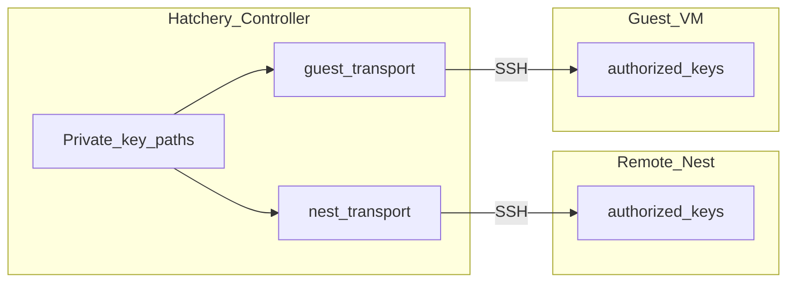

# Guest transport

Controller → **guest VM** remoting for ready-probe, Scripts, Software staging/install/detect, and related hatch steps.

This is **not** Nest transport. Nest SSH/WinRM talks to the Nest hypervisor host; Guest transport talks to the VM after first-boot. Shared OpenSSH **client** helpers live in [`lib/openssh_client.py`](../lib/openssh_client.py); credentials and configs stay separate ([ADR-0029](adr/0029-guest-ssh-bootstrap-and-guest-transport.md), [ADR-0030](adr/0030-controller-remoting-identities.md)).

## Preference

| Channel | Role |
|---|---|
| **SSH** | Primary (run PowerShell + SCP file put) |
| **WinRM** | Windows fallback when SSH TCP/auth is unavailable |

Resolve path: [`lib/guest_transport.py`](../lib/guest_transport.py) (`resolve_guest_transport`). Callers in [`lib/provision.py`](../lib/provision.py) and [`lib/software_provision.py`](../lib/software_provision.py) go through that seam - do not open a second WinRM/SSH path for Scripts vs Software.

## Auth

Controller remoting identities ([ADR-0030](adr/0030-controller-remoting-identities.md) / [#524](https://github.com/dustinestes/Hatchery/issues/524)): Clutch `remoting.ssh.authorize` lists identity ids (default `hatchery`). After first-boot ready:

1. Inject authorized pubkeys (user `.ssh/authorized_keys` and Windows `administrators_authorized_keys`)
2. Verify key SSH via `guest_transport` (BatchMode + identity path; first authorize id is the Controller client key)
3. Disable guest SSH `PasswordAuthentication`

Empty `authorize` is invalid. Nest `remoting_identity_id` is **never** auto-copied into guest authorize. WinRM may still use hatch password until [#156](https://github.com/dustinestes/Hatchery/issues/156). Password SSH (sshpass / `SSH_ASKPASS`) remains only for the pre-authorize window and WinRM fallback.

Inject uses pubkey material that matches the Controller private key on disk (`.pub` / `ssh-keygen -y`), not a stale `remoting_identities.pubkey` catalog column. The Remoting identities validator alerts when catalog and disk diverge ([#537](https://github.com/dustinestes/Hatchery/issues/537)).

### Public key distribution

Private keys stay on the Controller disk (path references only). Matching **public** keys must be installed where SSH servers accept them:

The Controller need not sit on a Nest: Remote Nest SSH is the control plane to the hypervisor host ([architecture-nests.md](architecture-nests.md)).

## Ready-gate

`hatchery-ready` still means first-boot finished with OpenSSH up (ADR-0029). The Controller probes the flag over Guest transport (SSH preferred). See [orchestration](orchestration.md).

## Operator visibility

When SSH cannot be used, hatch events record a WARN fallback reason and INFO notes the chosen remoting kind (`ssh` / `winrm`).

## Related

- Nest plane: [nest-transport.md](nest-transport.md)
- Remoting identities: [ADR-0030](adr/0030-controller-remoting-identities.md)
- Software staging: [software.md](software.md)
- Issue: [#497](https://github.com/dustinestes/Hatchery/issues/497)
