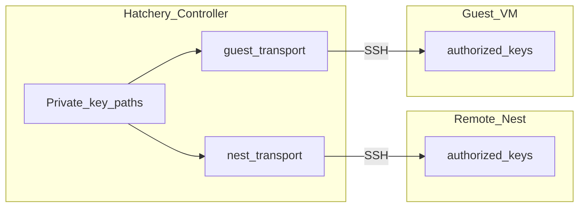

# Guest transport

Controller → **guest VM** remoting for ready-probe, Scripts, Software staging/install/detect, and related hatch steps.

This is **not** Nest transport. Nest SSH/WinRM talks to the Nest hypervisor host; Guest transport talks to the VM after first-boot. Shared OpenSSH **client** helpers live in [`lib/openssh_client.py`](../lib/openssh_client.py); credentials and configs stay separate ([ADR-0029](adr/0029-guest-ssh-bootstrap-and-guest-transport.md), [ADR-0030](adr/0030-controller-remoting-identities.md)).

## Preference

| Channel | Role |
|---|---|
| **SSH** | Primary (run PowerShell + SCP file put) |
| **WinRM** | Windows fallback when SSH TCP/auth is unavailable |

Resolve path: [`lib/guest_transport.py`](../lib/guest_transport.py) (`resolve_guest_transport`). Callers in [`lib/provision.py`](../lib/provision.py) and [`lib/software_provision.py`](../lib/software_provision.py) go through that seam - do not open a second WinRM/SSH path for Scripts vs Software.

## Auth

**Today (until remoting-identity impl):** hatch admin username/password (session row). Password SSH uses Controller `sshpass` when present, otherwise a short-lived `SSH_ASKPASS` helper.

**Target ([ADR-0030](adr/0030-controller-remoting-identities.md) / [#519](https://github.com/dustinestes/Hatchery/issues/519)):** Controller remoting identities (Hatchery-managed + operator path refs). Clutch `remoting.ssh.authorize` lists identity ids; after pubkeys are installed and key SSH is verified, guest SSH password auth is disabled. WinRM may still use hatch password until [#156](https://github.com/dustinestes/Hatchery/issues/156). Do **not** silently reuse a Nest binding as guest authorize.

### Public key distribution

Private keys stay on the Controller disk (path references only). Matching **public** keys must be installed where SSH servers accept them:

The Controller need not sit on a Nest: Remote Nest SSH is the control plane to the hypervisor host ([architecture-nests.md](architecture-nests.md)).

## Ready-gate

`hatchery-ready` still means first-boot finished with OpenSSH up (ADR-0029). The Controller probes the flag over Guest transport (SSH preferred). See [orchestration](orchestration.md).

## Operator visibility

When SSH cannot be used, hatch events record a WARN fallback reason and INFO notes the chosen remoting kind (`ssh` / `winrm`).

## Related

- Nest plane: [nest-transport.md](nest-transport.md)
- Remoting identities: [ADR-0030](adr/0030-controller-remoting-identities.md)
- Software staging: [software.md](software.md)
- Issue: [#497](https://github.com/dustinestes/Hatchery/issues/497)
